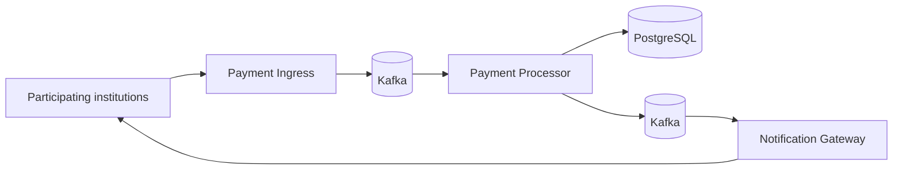

# Instant Payment System

Pix is Brazil's instant payment system. It lets people transfer money from one account to another in a few seconds, 24 hours a day, every day of the year, and it is usually free for individuals.

Today, this feels normal. Before Pix, it did not.

Sending money between banks meant using TED or DOC, dealing with business hours, business days, fees, and sometimes waiting for the money to arrive. Pix made that experience much simpler: you open your phone, send the money, and it is done.

What caught my attention was the scale. Pix does not do this once. It does it **millions of times**.

It moves money between different institutions all the time, while most of that work stays invisible to the user. You make a Pix payment, and it simply works.

That made me ask: **how can a system do this millions of times per day and keep simply working?**

That question led to this project.

Before I started building it, I looked for material about how Pix was designed and tested. I found a [podcast about its architecture](https://open.spotify.com/episode/0r7a7HORZspD35Dn7y4WTY), talks with engineers from the Central Bank of Brazil, public requirements, and early performance reports from the system.

## The challenge

The real Pix serves an entire country and uses much more infrastructure than this project can cover. I needed to choose one part of the problem.

Instead of trying to copy Pix, I built a much smaller version of its inter-institution core. One institution sends a payment order, and the receiving institution accepts or rejects it. The system then settles the reserved amount or returns it, and sends the required confirmations back to the participants.

The core does not model customer accounts and balances inside each bank. It models the liquidity that each participating institution keeps in the system and the flow between the paying and receiving institutions. The receiving institution makes the accept or reject decision, not the person who would receive the Pix payment.

Material published by the Central Bank gave me concrete references. A [presentation about architecture and resilience](https://www.bcb.gov.br/content/estabilidadefinanceira/pix/Forum_Pix_Plenaria/Forum_PI_180220.pdf) used **2,000 transactions per second** as a reference. The [2021 SPI annual report](https://www.bcb.gov.br/content/estabilidadefinanceira/relatorios_SPI/relatorio_anual_spi_2021.pdf) recorded the service-level agreement: 99% of payments processed inside SPI in less than **4.6 seconds**.

The same report included another useful number: in practice, the time needed to process 99% of payments stayed close to or below **1 second** during much of the observed period.

Those numbers became the target for this project:

> **Sustain at least 2,000 payments per second, with 99% finishing in less than 1 second, without losing results or producing contradictions.**

I also wanted to reach that target with a small architecture that could run locally, instead of solving the problem only by adding more hardware.

## The result

In the final version, I ran the same test twice with the same clean revision of the system and the same load.

The system met the target in both runs:

| Result | Run A | Run B |
| --- | ---: | ---: |
| Lowest observed rate | 2,017 payments/s | 2,079 payments/s |
| 99% of payments finished within | 855 ms | 265 ms |
| Missing or contradictory results | 0 | 0 |

Run A was clearly the less favorable one. It came closer to both limits, but still met the criteria.

I kept both runs in the final results. Showing only the best run would make the numbers look better. Keeping the less favorable run as well shows that the system still met the target under that condition.

## What needs to happen for each payment

The numbers above only matter if every payment still goes through the normal flow.

For a Pix user, the experience is still just sending money to another person. In this project, the flow starts at the paying institution and ends at the receiving institution. If the receiver accepts, the reserved liquidity is transferred to it. If it rejects, the amount becomes available to the paying institution again. The paying institution must receive the result. After settlement, the receiving institution also gets its confirmation.

So far, that sounds simple.

The problem starts when things do not happen perfectly:

* **The paying institution can send the same order again.** This must not reserve the amount twice or credit the receiver again.
* **Two payments can compete for the same institution's liquidity.** They cannot both spend the same available balance.
* **Part of the system can fail in the middle of a payment.** The money cannot simply disappear between institutions.
* **The payment can be finished while its confirmation has not reached the participants yet.** The confirmation may arrive later, but it cannot simply disappear.

These problems start to define how the system needs to be built.

The project splits the work like this:



The **Payment Ingress** receives and authenticates payments entering the system.

The **Payment Processor** is the center of the flow. It tracks each payment, decides what happens to the money, and prevents the same payment from changing liquidity balances twice.

**PostgreSQL** stores payments and liquidity balances. It also lets the system commit together all changes that belong to the same operation.

**Kafka** connects the asynchronous parts of the system and keeps work available while it moves between components.

The **Notification Gateway** tells institutions whether a payment was completed or rejected, including when that information needs to arrive after a failure.

This is the high-level map. The [system design](docs/design.md) explains how each problem is handled and why these choices were made.

## How I measured it

Building the system was only half of the problem. If I wanted to say it sustained 2,000 payments per second, I needed to make sure I was measuring real payments, not only requests accepted at the entry point.

For that reason, a successful HTTP response only means that the **Payment Ingress** accepted the message. In the test, a payment finishes only when its confirmation goes through the system and comes back to the paying institution.

The load generator stays outside the core. It sends payments, observes the confirmations that come back, and checks whether they match what should have happened.

The same run must meet both requirements: it must be fast and it must return every expected result without contradictions. Reaching the payments-per-second target does not count if the observable result of the flow is wrong.

The benchmark includes duplicates and concurrency under load. The main financial property is that a repeated message must not move money again. The [concurrent Payment Processor tests](spi/src/test/java/br/kauan/spi/domain/services/ConcurrentParticipantBalanceIntegrationTest.java) check reservation, credit, and return directly on participant liquidity balances.

Details about load generation, throughput and latency calculation, and how evidence is preserved are in the [performance methodology](docs/performance.md).

## Run it

The host needs Linux, Docker, and Docker Compose.

To start a clean stack and run the functional smoke test:

```bash
cd load-test
./prepare-performance-environment.sh --profile mixed-outcomes-smoke
./run-load-test.sh --profile mixed-outcomes-smoke smoke
```

To run the profile used for the final performance measurement:

```bash
cd load-test
./prepare-performance-environment.sh --profile mixed-outcomes-2k-15m
./run-load-test.sh --profile mixed-outcomes-2k-15m qualification
```

Results are stored in:

```text
load-test/results/<run-tag>/<timestamp>/
```

### Optional visual diagnostics

Prometheus and Grafana can track CPU, memory, Kafka, and PostgreSQL during an investigation. They are not part of the stack used to qualify the final result because they also consume host resources.

After preparing the environment, start the observability stack before running the load test:

```bash
docker compose -f infra/docker-compose.yml --profile observability up -d
```

The dashboard is available at [http://localhost:3000](http://localhost:3000). When the run finishes, the runner also writes a link covering the full diagnostic interval to `load-test/results/<run-tag>/<timestamp>/logs/grafana-url.txt`.

## Learn more

* **[System design](docs/design.md)** — how the project handles duplicates, concurrency, failures, and confirmation delivery.
* **[Engineering evolution](docs/engineering-evolution.md)** — which measurements changed the design, which alternatives were removed, and why the system ended up this way.
* **[Performance](docs/performance.md)** — load, methodology, environment, results, and benchmark scope.
* **[Reference demo](demo/README.md)** — a visual flow with simulated institutions for exploring the system manually.
