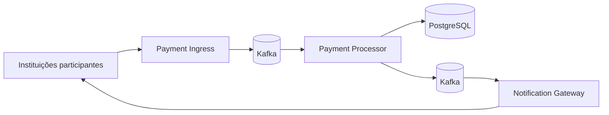

# Instant Payment System

O Pix é o sistema brasileiro de pagamentos instantâneos. Ele permite transferir dinheiro de uma conta para outra em poucos segundos, 24 horas por dia, todos os dias do ano e, para pessoas físicas, normalmente sem tarifa.

Hoje isso parece normal. Antes do Pix, não era.

Transferir dinheiro entre bancos significava usar TED ou DOC, lidar com horários, dias úteis, tarifas e, dependendo da transferência, esperar até o dinheiro chegar. O Pix praticamente apagou essa experiência: você abre o celular, envia o dinheiro e pronto.

O que me chamou atenção é que ele não faz isso uma vez. Faz **milhões de vezes**.

Ele movimenta dinheiro entre instituições diferentes o tempo todo, e ninguém reclama dele. Você faz um Pix e ele simplesmente funciona.

Foi aí que comecei a me perguntar: **como eles conseguem fazer isso?**

Como um sistema consegue fazer isso milhões de vezes por dia e continuar simplesmente funcionando?

Foi dessa curiosidade que nasceu este projeto.

Antes de começar a construir, fui procurar como o Pix havia sido desenvolvido e testado. Encontrei um [podcast sobre sua arquitetura](https://open.spotify.com/episode/0r7a7HORZspD35Dn7y4WTY), conversas com engenheiros do Banco Central, requisitos públicos e os primeiros relatórios de desempenho do sistema.

## O desafio

O Pix real é um sistema enorme, construído para atender um país inteiro e sustentado por uma infraestrutura que obviamente está muito além do que eu conseguiria reproduzir sozinho.

Então eu precisava escolher uma parte do problema.

Em vez de tentar copiar o Pix, construí uma versão muito menor do fluxo de pagamento: alguém envia dinheiro, o recebedor aceita ou rejeita, o valor chega ao destino ou continua com quem tentou pagar, e o resultado volta aos participantes.

Os materiais publicados pelo Banco Central me deram referências concretas. Uma [apresentação sobre arquitetura e resiliência](https://www.bcb.gov.br/content/estabilidadefinanceira/pix/Forum_Pix_Plenaria/Forum_PI_180220.pdf) usava **2.000 transações por segundo** como parâmetro. O [relatório anual do SPI de 2021](https://www.bcb.gov.br/content/estabilidadefinanceira/relatorios_SPI/relatorio_anual_spi_2021.pdf) registrava o acordo de nível de serviço: 99% dos pagamentos processados dentro do SPI em menos de **4,6 segundos**.

O mesmo relatório mostrava outra coisa interessante: na prática, o tempo necessário para processar 99% dos pagamentos ficava próximo ou abaixo de **1 segundo** durante grande parte do período observado.

Esses números viraram a referência do projeto:

> **Sustentar pelo menos 2.000 pagamentos por segundo, com 99% deles terminando em menos de 1 segundo, sem começar a quebrar o básico.**

E havia outra restrição que me interessava: eu queria chegar lá com uma arquitetura pequena, que pudesse rodar localmente, e não simplesmente resolver o problema jogando mais hardware em cima.

## O resultado

Na versão final, rodei o mesmo teste duas vezes, usando a mesma revisão limpa do sistema e a mesma carga.

A meta que defini a partir dessas referências era sustentar pelo menos **2.000 pagamentos por segundo**, com **99% deles terminando em menos de 1 segundo**.

O sistema bateu a meta nas duas execuções:

| Resultado                            |         Execução A |         Execução B |
| ------------------------------------ | -----------------: | -----------------: |
| Menor taxa observada                 | 2.017 pagamentos/s | 2.079 pagamentos/s |
| 99% dos pagamentos terminaram em até |             855 ms |             265 ms |
| Outcomes ausentes ou contraditórios |                  0 |                  0 |

A execução A foi claramente a menos favorável: chegou mais perto dos dois limites, mas ainda passou.

Mantive as duas na evidência final. Mostrar apenas a melhor execução produziria um resultado mais bonito; manter a pior mostra que o sistema continuou dentro da meta mesmo na condição menos favorável observada.

## O que precisa acontecer em cada pagamento

Os números acima só fazem sentido porque cada pagamento continua tendo que percorrer o fluxo normalmente.

No caso mais simples, alguém envia dinheiro para outra pessoa. O recebedor aceita ou rejeita o pagamento. Se aceitar, o dinheiro chega até ele. Se rejeitar, continua com quem tentou pagar. E quem enviou precisa saber como aquilo terminou.

Até aí, parece simples.

O problema começa quando as coisas não acontecem perfeitamente:

* **A confirmação pode demorar e a pessoa tentar enviar de novo.** Ela não pode ser debitada duas vezes por causa disso, nem o recebedor receber o valor duas vezes.
* **Dois pagamentos podem sair da mesma conta ao mesmo tempo.** Os dois não podem gastar o mesmo dinheiro.
* **Alguma parte do sistema pode falhar no meio do pagamento.** O dinheiro não pode simplesmente ficar perdido entre uma conta e outra.
* **O pagamento pode já ter terminado, mas a confirmação pode não chegar na hora para quem pagou ou para quem recebeu.** Ela pode chegar depois, mas não pode simplesmente se perder.

É esse tipo de problema que começa a determinar como o sistema precisa ser construído.

No projeto, o trabalho fica dividido assim:



O **Payment Ingress** recebe e autentica os pagamentos que chegam ao sistema.

O **Payment Processor** é o centro do fluxo. Ele acompanha cada pagamento, decide o que acontece com o dinheiro e impede que o mesmo pagamento altere os saldos duas vezes.

O **PostgreSQL** guarda os pagamentos e os saldos e permite que mudanças que pertencem à mesma operação sejam confirmadas juntas.

O **Kafka** conecta as partes assíncronas do sistema e mantém o trabalho disponível enquanto ele avança entre os componentes.

O **Notification Gateway** informa às instituições se o pagamento foi concluído ou rejeitado, inclusive quando essa informação precisa chegar depois de uma falha.

Esse é o mapa geral. O [design do sistema](docs/design.md) explica como cada um desses problemas é tratado e por que essas decisões foram tomadas.

## Como eu medi

Construir o sistema era só metade do problema. Se eu queria afirmar que ele sustentava 2.000 pagamentos por segundo, precisava ter certeza de que estava medindo pagamentos de verdade, e não apenas requisições chegando na entrada.

Por isso, uma resposta HTTP bem-sucedida significa apenas que o **Payment Ingress** aceitou a mensagem. Para o teste, o pagamento só termina quando a confirmação percorre o sistema e volta à instituição de quem enviou.

A ferramenta de carga fica fora do core: ela envia os pagamentos, observa as confirmações que retornam e verifica se elas correspondem ao que deveria ter acontecido.

A mesma execução precisa passar nos dois lados: ser rápida e devolver todos os outcomes esperados sem contradição. Bater a meta de pagamentos por segundo não vale se o resultado observável do fluxo estiver incorreto.

O benchmark exercita duplicidade e concorrência sob carga. A garantia financeira mais forte — uma mensagem repetida não pode mover dinheiro novamente — é verificada diretamente pelos [testes concorrentes do Payment Processor](spi/src/test/java/br/kauan/spi/domain/services/ConcurrentParticipantBalanceIntegrationTest.java), que conferem reserva, crédito e devolução nos saldos persistidos.

Os detalhes de geração da carga, cálculo de throughput e latência e preservação das evidências ficam na [metodologia de performance](docs/performance.md).

## Executar

O host precisa de Linux, Docker e Docker Compose.

Para subir uma stack limpa e executar o smoke funcional:

```bash
cd load-test
./prepare-performance-environment.sh --profile mixed-outcomes-smoke
./run-load-test.sh --profile mixed-outcomes-smoke smoke
```

Para executar o perfil usado na qualificação de performance:

```bash
cd load-test
./prepare-performance-environment.sh --profile mixed-outcomes-2k-15m
./run-load-test.sh --profile mixed-outcomes-2k-15m qualification
```

Os resultados ficam em:

```text
load-test/results/<run-tag>/<timestamp>/
```

## Aprofundar

* **[Design do sistema](docs/design.md)** — como o projeto lida com duplicidade, concorrência, falhas e entrega das confirmações.
* **[Evolução da engenharia](docs/engineering-evolution.md)** — quais medições mudaram o desenho, quais alternativas foram descartadas e por que o sistema terminou assim.
* **[Performance](docs/performance.md)** — carga, metodologia, ambiente, resultados e limites do benchmark.
* **[Evidência das qualificações](docs/performance/evidence/2026-08-29/manifest.md)** — artefatos das execuções que sustentam o resultado apresentado neste README.
* **[Demonstração de referência](demo/README.md)** — um fluxo visual com instituições simuladas para explorar o sistema manualmente.
