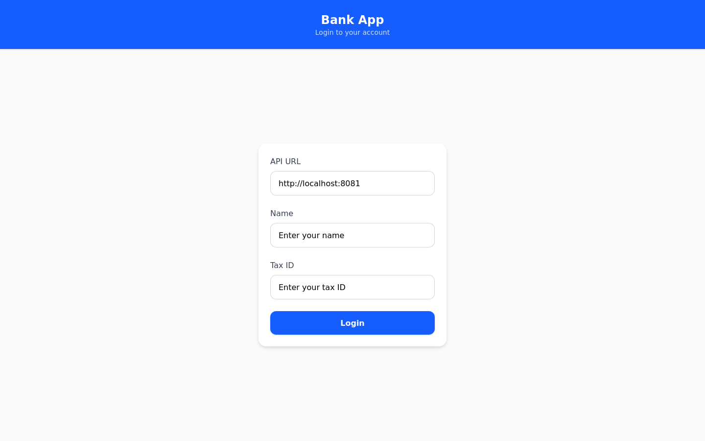

# Reference demo

This directory contains a small interactive demonstration of the instant-payment system. It is not part of the benchmarked core and carries no performance, durability, availability, or production-readiness guarantees.

The demo contains a minimal DICT, two simulated PSPs and an Angular application. Its only commitment is a reproducible happy path: create two customers, register a PIX key, resolve the receiver, submit a payment through the core and observe the resulting balance changes at both PSPs.

## Start

Start the core first from the repository root:

```bash
LOCAL_UID=$(id -u) LOCAL_GID=$(id -g) docker compose -f infra/docker-compose.yml up -d --build
```

Then start the reference demo:

```bash
LOCAL_UID=$(id -u) LOCAL_GID=$(id -g) docker compose -f demo/docker-compose.yml up -d --build
```

Open <http://localhost:4200>. PSP A is available at `http://localhost:8081`; PSP B is available at `http://localhost:8082`. Log into PSP A as Alice, create Bob and a PIX key through PSP B, then submit the transfer through the web application. The [Bruno collection](../docs/collection/README.md) provides the same flow as explicit API calls.

The automated smoke exercises the complete business path and verifies the final balance changes observed by both PSPs:

```bash
./demo/smoke.sh
```

## Interface



## Reset

The demo owns its DICT database and the PSPs use ephemeral local state. Reset all demo state without touching the core:

```bash
docker compose -f demo/docker-compose.yml down -v --remove-orphans
```

## Scope

The demo deliberately does not provide production-grade PSP persistence, HA, performance tuning, comprehensive error handling, broad test coverage, or a complete DICT. The Rust load tool remains the authoritative instrument for core correctness and performance validation.
