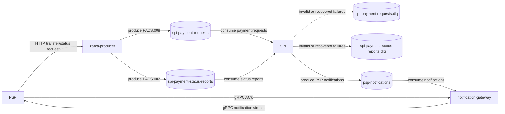

# Kafka Message Flow

This document summarizes how PSPs, Kafka, SPI, and the notification gateway exchange payment messages.

## Topics

| Topic                            | Producer         | Consumer               | Payload                          |
| -------------------------------- | ---------------- | ---------------------- | -------------------------------- |
| `spi-payment-requests`           | `kafka-producer` | `spi`                  | Internal protobuf payment request |
| `spi-payment-status-reports`     | `kafka-producer` | `spi`                  | Internal protobuf status report   |
| `spi-payment-requests.dlq`       | `spi`            | Manual operation       | Original failed Kafka value       |
| `spi-payment-status-reports.dlq` | `spi`            | Manual operation       | Original failed Kafka value       |
| `psp-notifications`              | `spi`            | `notification-gateway` | PSP notifications routed by ISPB  |

## Boundary

PSPs do not consume Kafka directly. They submit payment messages to `kafka-producer` over HTTP, and receive SPI notifications from `notification-gateway` through the gRPC stream.

The notification stream is bidirectional. The PSP identity comes from its mTLS client certificate, and the PSP sends an ACK only after processing a delivery successfully. The `notification-gateway` tracks each delivery by `communication_id` and retries unacknowledged deliveries with an `IN_FLIGHT` lease.

## Failure Policy

SPI DLQ behavior is documented in [Kafka DLQ Policy](KAFKA_DLQ_POLICY.md).

Replay and duplicate handling behavior is documented in [Idempotency and Replay Policy](IDEMPOTENCY_REPLAY_POLICY.md).
