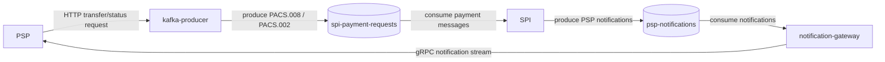

# Kafka Message Flow

This document summarizes how PSPs, Kafka, SPI, and the notification gateway exchange payment messages.

## Topics

| Topic                  | Producer         | Consumer               | Payload                                                    |
| ---------------------- | ---------------- | ---------------------- | ---------------------------------------------------------- |
| `spi-payment-requests` | `kafka-producer` | `spi`                  | `PACS.008` transfer requests and `PACS.002` status reports |
| `psp-notifications`    | `spi`            | `notification-gateway` | PSP notifications routed by ISPB                           |

## Boundary

PSPs do not consume Kafka directly. They submit payment messages to `kafka-producer` over HTTP, and receive SPI notifications from `notification-gateway` through the gRPC stream.
