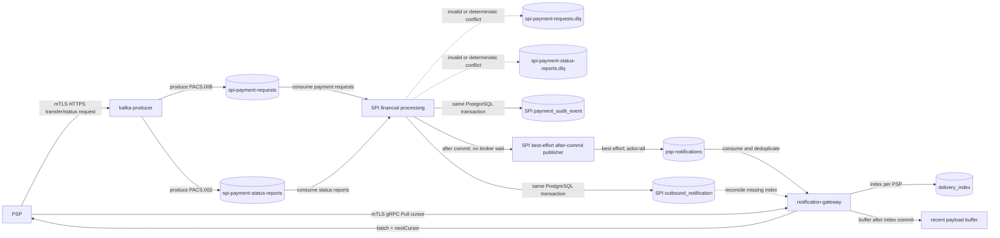

# Kafka Message Flow

This document summarizes how PSPs, Kafka, the SPI transactional notification
store, and the notification gateway exchange payment messages.

```mermaid
flowchart LR
    PSP["PSP"]
    Producer["kafka-producer"]
    PaymentRequests[("spi-payment-requests")]
    StatusReports[("spi-payment-status-reports")]
    PaymentRequestsDlq[("spi-payment-requests.dlq")]
    StatusReportsDlq[("spi-payment-status-reports.dlq")]
    SPI["SPI financial processing"]
    Audit[("SPI payment_audit_event")]
    Outbound[("SPI outbound_notification")]
    FastPath["SPI best-effort after-commit publisher"]
    Notifications[("psp-notifications")]
    Gateway["notification-gateway"]
    Delivery[("delivery_index")]
    Buffer["recent payload buffer"]

    PSP -->|"mTLS HTTPS transfer/status request"| Producer
    Producer -->|"produce PACS.008"| PaymentRequests
    Producer -->|"produce PACS.002"| StatusReports
    PaymentRequests -->|"consume payment requests"| SPI
    StatusReports -->|"consume status reports"| SPI
    SPI -.->|"invalid or deterministic conflict"| PaymentRequestsDlq
    SPI -.->|"invalid or deterministic conflict"| StatusReportsDlq
    SPI -->|"same PostgreSQL transaction"| Audit
    SPI -->|"same PostgreSQL transaction"| Outbound
    SPI -->|"after commit; no broker wait"| FastPath
    FastPath -->|"best effort; acks=all"| Notifications
    Notifications -->|"consume and deduplicate"| Gateway
    Gateway -->|"index per PSP"| Delivery
    Outbound -.->|"reconcile missing index"| Gateway
    Gateway -->|"buffer after index commit"| Buffer
    PSP -->|"mTLS gRPC Pull cursor"| Gateway
    Gateway -->|"batch + nextCursor"| PSP
```

## Topics

| Topic | Producer | Consumer | Payload |
| --- | --- | --- | --- |
| `spi-payment-requests` | `kafka-producer` | `spi` | Internal protobuf payment request |
| `spi-payment-status-reports` | `kafka-producer` | `spi` | Internal protobuf status report |
| `spi-payment-requests.dlq` | `spi` | Manual operation | Original failed Kafka value |
| `spi-payment-status-reports.dlq` | `spi` | Manual operation | Original failed Kafka value |
| `psp-notifications` | SPI after-commit fast path | `notification-gateway` | Stored opaque `BYTEA` payload routed by ISPB |

## Transport Boundary

PSPs do not consume Kafka directly. They submit messages to `kafka-producer` over mTLS HTTPS and pull SPI notifications from `notification-gateway` through unary gRPC calls over a persistent HTTP/2/mTLS connection.

Each PSP maintains one logical pull flow. A request carries only the last cursor processed durably by that PSP. When backlog is available, the Gateway immediately returns the next 15 notifications at most, in stable order, plus an opaque HMAC-authenticated `nextCursor`; when the backlog is empty, the existing long poll waits for new work or its timeout. The fixed limit of 15 is part of the protocol rather than a client or profile setting. The PSP advances its durable cursor only after processing the complete response; presenting an older cursor redelivers the corresponding rows and therefore provides at-least-once delivery without individual ACK writes, leases, or an active redelivery scheduler.

The SPI notification store and Gateway index protect different boundaries:

| Boundary | Durable owner | Completion evidence in that boundary |
| --- | --- | --- |
| Confirmed financial fact to eventual indexing | SPI `outbound_notification` | The immutable notification exists in the same transaction as the financial fact |
| Kafka consumption to PSP processing | Gateway `delivery_index` + PSP cursor | PSP durably retained the last Gateway-issued cursor it fully processed |

Once per minute, the Gateway reconciles any `outbound_notification` row older
than one minute that has no `delivery_index`. The age boundary prevents an
ordinary in-flight Kafka event from being mistaken for a recovery candidate.
Kafka therefore remains the normal low-latency path, while PostgreSQL is
sufficient for eventual indexing after a rare publication or Gateway failure.
The Gateway does not persist PSP progress in the hot path; the PSP is
authoritative for the last cursor it processed, while the Gateway is
authoritative for whether that opaque cursor was genuinely issued for the
authenticated PSP.

## Transactional Financial, Audit, and Notification Write Path

For each input batch, the SPI performs three separate bulk database operations in one PostgreSQL transaction:

1. classify and apply the current financial statement;
2. insert business events for only the effective results into `payment_audit_event`;
3. insert obligations for only the effective results into `outbound_notification`.

Atomicity does not depend on placing all work in one CTE.
`PaymentTransactionProcessorService` keeps the transaction open across the
three statements. Audit or notification persistence failure rolls back payment
creation, status, balances, audit rows, and obligations together.

The facts mapped to audit rows are:

- new `pacs.008`: `PAYMENT_CREATED`;
- effective status transition: `PAYMENT_STATUS_CHANGED`;
- effective settlement: `PAYMENT_STATUS_CHANGED` and `SETTLEMENT_APPLIED` in the same bulk and transaction;
- replay with an effective business change: the same normal events;
- replay or processing that results in `NOOP`: no audit event.

`event_id` is only a technical identity. There is no ordering guarantee between the status-change and settlement rows produced by the same operation.

The facts mapped to outbound-notification rows are:

- new `pacs.008`: one `ACCEPTANCE_REQUEST` to the receiver;
- effective `REJECTED` transition: one `REJECTED_NOTIFICATION/RJCT` to the payer;
- effective settlement: `SETTLED_NOTIFICATION/ACSC` to the payer and `SETTLED_NOTIFICATION/ACCC` to the receiver.

Notification serialization uses `ObjectMapper.writeValueAsBytes(...)` before
the notification bulk insert. Failure during audit persistence, validation,
serialization, or notification insertion rolls back the financial statement,
status, and balances. The input Kafka acknowledgment happens after the
PostgreSQL commit; it does not wait for notification publication.

The financial transition is the authority for creating notification items.
Only payments effectively created or transitioned by the current transaction
contribute an item; identical `pacs.008` and `pacs.002` replays that acquire no
transition are no-ops. The outbox insert is strict: an insertion failure rolls
the financial transaction back instead of acting as a second idempotency
layer. There is no backfill for pre-migration payments.

Items are grouped by recipient while preserving their source order, then split
into consecutive messages of at most 15 items. Acceptance requests group
`pacs.008` items by receiver. Status notifications group `pacs.002` items by
recipient; statuses such as `ACSC`, `ACCC`, and `RJCT` can coexist because each
transaction item carries its own outcome. Every resulting message receives a
new UUID, used both as `GrpHdr.MsgId` and as `communication_id`.

## Persisted Message Contract

The business payload is created and serialized once per message, then persisted
as `BYTEA`. Publication sends the exact stored bytes and never reloads the
payment to reconstruct content. `outbound_notification` contains only
`communication_id`, `recipient_ispb`, `payload`, and `created_at`.

Topic, key, and headers are deterministic and therefore not persisted:

- topic: `psp-notifications`;
- key: `recipient_ispb`;
- required header: `notification.communication-id`.

The producer uses `StringSerializer` for the key, `ByteArraySerializer` for the payload, and `acks=all`.

## Best-Effort Kafka Fast Path

The SPI publishes an in-process event containing only the notifications inserted
by the current transaction. An `AFTER_COMMIT` listener starts one asynchronous
Kafka send per notification and returns without waiting for broker futures.

The producer still uses `acks=all`, but its acknowledgement is operational
feedback only. Synchronous and asynchronous send failures are logged; they do
not update `outbound_notification`, retry in the SPI, or change the already
committed financial result. A process crash between the PostgreSQL commit and
the send can therefore skip Kafka entirely. The Gateway reconciler closes that
gap from the durable notification store.

## Concurrency and Deduplication

Every physical duplicate carries the same `communicationId`. The notification
gateway indexes it once, so Kafka producer retries or a Kafka/reconciler race
produce one logical backlog entry and consume no new position. A Gateway-owned
`delivery_position` is consecutive within each PSP flow and independent of
Kafka partitions and offsets; cursor validity therefore survives Kafka
repartitioning. Concurrent batches for the same PSP serialize position
allocation with a transaction-scoped advisory lock, while different PSPs
remain independent.

After the index transaction commits, the Gateway keeps a bounded recent payload
window in memory for each PSP. A Pull is served from RAM only when the window
contains a contiguous sequence beginning immediately after the supplied
cursor. A miss, gap, or restart falls back directly to
`delivery_index JOIN outbound_notification`; this fallback answers that Pull
and does not introduce a separate cache-rehydration lifecycle.

The system guarantees a durable notification obligation and at-least-once PSP
delivery. It does not guarantee Kafka publication for every notification or
exactly-once physical delivery.

## Failure Policy

SPI DLQ behavior is documented in [Kafka DLQ Policy](KAFKA_DLQ_POLICY.md). Replay behavior is documented in [Idempotency and Replay Policy](IDEMPOTENCY_REPLAY_POLICY.md).

PostgreSQL resource failures raised while inserting notification obligations are not wrapped as notification errors. They reach the input consumer as database infrastructure failures, so the batch remains unacknowledged and follows the indefinite infrastructure retry path instead of DLQ recovery.

PostgreSQL resource failures raised by the business-audit insert follow the same path and are also not wrapped. Constraint failures remain visible and roll back the financial operation; audit inserts do not use `ON CONFLICT` to hide unexpected classification errors.

Best-effort Kafka publication failure is not sent to a DLQ and is not retried
by the SPI. The immutable row remains available for the Gateway reconciler.

## Limitações Conscientes

- The SPI does not durably record whether the best-effort Kafka send succeeded.
- A Kafka outage moves delivery to the reconciler's one-to-two-minute recovery
  latency instead of causing an SPI publication retry.
- The reconciler performs a historical anti-join once per minute; there is no
  durable worklist or watermark.
- `outbound_notification` and `delivery_index` are retained indefinitely and
  grow continuously without retention or cleanup.
- Observability is limited to logs and manual table queries; this cut adds no
  notification-store metrics or dashboard.
- There is no exactly-once guarantee; physical duplicates are an expected consequence of at-least-once delivery.
- The Gateway retains all `delivery_index` rows; cursor-based retention/GC is not implemented in this MVP.
- Only one pull may be active per PSP; parallel cursor shards are outside the MVP.
- Business audit starts at its migration; there is no historical backfill.
- Audit rows have no causal ordering guarantee, and `event_id` is only a technical identity.
- Audit has no retention, cleanup, partitioning, archived history, dedicated metrics, or comparative load-test gate in this cut.
- `NOOP` replay, retries, redelivery, rejected inputs, and original PACS payloads are outside the business audit.
- These simplifications are suitable for the MVP, but do not necessarily represent the final production design.

## Sinais para Evolução

Introduce a reconciliation worklist/watermark, retention, or cleanup when one
or more of these signals appears:

- physical duplicate volume or duplicate-caused Kafka traffic grows materially;
- CPU, database, or notification-gateway load caused by duplicates becomes excessive;
- reconciler scans become material as history grows;
- the recovery latency after a Kafka failure is no longer acceptable;
- durable per-attempt Kafka diagnostics become necessary;
- table growth requires retention, partitioning, or cleanup;
- audit-table or WAL growth materially affects PostgreSQL capacity, throughput, or latency;
- a terminal state or operational treatment for irrecoverable notification
  data becomes necessary.
