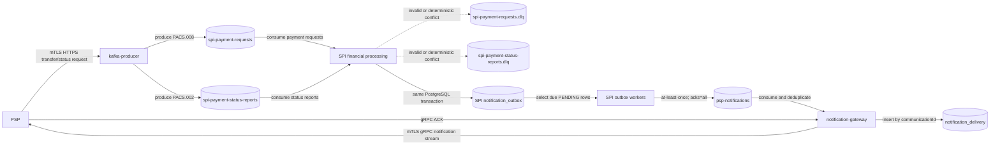

# Kafka Message Flow

This document summarizes how PSPs, Kafka, the SPI transactional outbox, and the notification gateway exchange payment messages.

```mermaid
flowchart LR
    PSP["PSP"]
    Producer["kafka-producer"]
    PaymentRequests[("spi-payment-requests")]
    StatusReports[("spi-payment-status-reports")]
    PaymentRequestsDlq[("spi-payment-requests.dlq")]
    StatusReportsDlq[("spi-payment-status-reports.dlq")]
    SPI["SPI financial processing"]
    Outbox[("SPI notification_outbox")]
    Worker["SPI outbox workers"]
    Notifications[("psp-notifications")]
    Gateway["notification-gateway"]
    Delivery[("notification_delivery")]

    PSP -->|"mTLS HTTPS transfer/status request"| Producer
    Producer -->|"produce PACS.008"| PaymentRequests
    Producer -->|"produce PACS.002"| StatusReports
    PaymentRequests -->|"consume payment requests"| SPI
    StatusReports -->|"consume status reports"| SPI
    SPI -.->|"invalid or deterministic conflict"| PaymentRequestsDlq
    SPI -.->|"invalid or deterministic conflict"| StatusReportsDlq
    SPI -->|"same PostgreSQL transaction"| Outbox
    Outbox -->|"select due PENDING rows"| Worker
    Worker -->|"at-least-once; acks=all"| Notifications
    Notifications -->|"consume and deduplicate"| Gateway
    Gateway -->|"insert by communicationId"| Delivery
    Gateway -->|"mTLS gRPC notification stream"| PSP
    PSP -->|"gRPC ACK"| Gateway
```

## Topics

| Topic | Producer | Consumer | Payload |
| --- | --- | --- | --- |
| `spi-payment-requests` | `kafka-producer` | `spi` | Internal protobuf payment request |
| `spi-payment-status-reports` | `kafka-producer` | `spi` | Internal protobuf status report |
| `spi-payment-requests.dlq` | `spi` | Manual operation | Original failed Kafka value |
| `spi-payment-status-reports.dlq` | `spi` | Manual operation | Original failed Kafka value |
| `psp-notifications` | SPI outbox workers | `notification-gateway` | Stored opaque `BYTEA` payload routed by ISPB |

## Transport Boundary

PSPs do not consume Kafka directly. They submit messages to `kafka-producer` over mTLS HTTPS and receive SPI notifications from `notification-gateway` through an mTLS gRPC stream.

The notification stream is bidirectional. PSP identity comes from its client certificate, and the PSP sends an ACK only after processing a delivery successfully. The gateway tracks each logical delivery by `communication_id` and retries unacknowledged deliveries with its own `IN_FLIGHT` lease.

The SPI outbox and gateway delivery table protect different boundaries:

| Boundary | Durable owner | Terminal marker in that boundary |
| --- | --- | --- |
| Confirmed financial fact to Kafka publication | SPI `notification_outbox` | `PUBLISHED`: Kafka broker confirmed the send with `acks=all` |
| Kafka consumption to PSP processing | Gateway `notification_delivery` | `ACKED`: PSP explicitly confirmed processing |

SPI `PUBLISHED` is not an end-to-end PSP ACK.

## Transactional Outbox Write Path

For each input batch, the SPI performs two bulk database operations in one PostgreSQL transaction:

1. classify and apply the current financial statement;
2. insert obligations for only the effective results into `notification_outbox`.

The facts mapped to outbox rows are:

- new `pacs.008`: one `ACCEPTANCE_REQUEST` to the receiver;
- effective `REJECTED` transition: one `REJECTED_NOTIFICATION/RJCT` to the payer;
- effective settlement: `SETTLED_NOTIFICATION/ACSC` to the payer and `SETTLED_NOTIFICATION/ACCC` to the receiver.

Serialization uses `ObjectMapper.writeValueAsBytes(...)` before the bulk insert. Failure during validation, serialization, or outbox insertion rolls back the financial statement, status, and bucket balances. The input Kafka acknowledgment happens after the PostgreSQL commit; it does not wait for outbox publication.

The `communication_id` primary key and `ON CONFLICT DO NOTHING` make replay idempotent at the obligation boundary. Identical `pacs.008` replay in `WAITING_ACCEPTANCE` keeps an existing `PENDING` or `PUBLISHED` row and recreates it if missing. Replay in advanced status and `pacs.002` that produces no new transition remain no-ops. There is no backfill for pre-migration payments.

## Persisted Message Contract

The business payload is created and serialized once per obligation, then persisted as `BYTEA`. Publication sends the exact stored bytes and never reloads the payment to reconstruct content.

Topic, key, and headers are deterministic and therefore not persisted:

- topic: `psp-notifications`;
- key: `recipient_ispb`;
- required headers: `notification.communication-id`, `notification.event-type`, `notification.payment-id`, and `notification.schema-version`;
- optional header: `notification.status`, reconstructed only when `notification_status` is present.

The producer uses `StringSerializer` for the key, `ByteArraySerializer` for the payload, and `acks=all`.

## Outbox Worker Flow

The scheduler runs independently in every SPI instance with these defaults:

- batch size: 1,000 due rows per instance;
- fixed delay: 20 ms;
- retry delay: one second;
- no attempt limit.

Each execution selects `PENDING` rows whose `next_attempt_at` has expired. It does not lock or claim them and holds no database transaction while contacting Kafka. It starts one asynchronous send per row before waiting for the futures, then separates successful and failed results.

Successes and failures are each updated in bulk:

- a broker-confirmed success changes a still-`PENDING` row to `PUBLISHED`, increments `attempt_count`, fills `published_at`, and clears `last_error`;
- a failed send keeps a still-`PENDING` row pending, increments `attempt_count`, sets the fixed retry time, and stores `last_error`.

Every update includes `WHERE publication_status = 'PENDING'`. A delayed failure cannot reopen a published row, while a delayed success can still publish a pending row. `PUBLISHED` is terminal.

Failure after Kafka accepts a send but before the database update leaves the row pending. A restart during selection or send has the same effect. Both cases intentionally allow republication and produce an at-least-once guarantee.

## Concurrency and Deduplication

There is no ownership, claim, lease, fencing, lock, or coordination among SPI workers. Multiple instances can select and physically publish the same row concurrently. This is accepted in the MVP.

Every duplicate carries the same `communicationId`. The notification gateway inserts delivery state with `ON CONFLICT (communication_id) DO NOTHING`, so physical Kafka duplicates produce one logical delivery and one end-to-end ACK lifecycle.

The system guarantees durable obligation plus at-least-once Kafka publication. It does not guarantee exactly-once publication.

## Failure Policy

SPI DLQ behavior is documented in [Kafka DLQ Policy](KAFKA_DLQ_POLICY.md). Replay behavior is documented in [Idempotency and Replay Policy](IDEMPOTENCY_REPLAY_POLICY.md).

PostgreSQL resource failures raised while inserting notification obligations are not wrapped as notification errors. They reach the input consumer as database infrastructure failures, so the batch remains unacknowledged and follows the indefinite infrastructure retry path instead of DLQ recovery.

Outbox publication failure is not sent to a DLQ in this cut. The row remains `PENDING` and retries indefinitely. `PUBLISHED` rows are not deleted automatically.

## Limitações Conscientes

- Several SPI instances can select and physically publish the same message.
- Duplicate sends can increase Kafka traffic, CPU use, database activity, and gateway load.
- Workers have no ownership, claim, lease, fencing, lock, or coordination.
- `attempt_count` is approximate and does not count every concurrent physical send exactly.
- `last_error` can be overwritten by a concurrent failure and may not represent the globally latest attempt.
- A delayed failure cannot reopen terminal `PUBLISHED` state.
- `PUBLISHED` rows are retained indefinitely and the table grows continuously without retention or cleanup.
- Fixed retry can create sustained pressure during a long Kafka outage.
- There is no `DEAD` state, attempt limit, or automatic recovery path for permanently invalid messages.
- Observability is limited to logs and manual table queries; this cut adds no outbox metrics or dashboard.
- There is no exactly-once guarantee; physical duplicates are an expected consequence of at-least-once delivery.
- These simplifications are suitable for the MVP, but do not necessarily represent the final production design.

## Sinais para Evolução

Introduce claim/lease, `FOR UPDATE SKIP LOCKED`, `claim_token`, fencing, coordinated ownership, richer retry, or cleanup when one or more of these signals appears:

- physical duplicate volume or duplicate-caused Kafka traffic grows materially;
- CPU, database, or notification-gateway load caused by duplicates becomes excessive;
- workers frequently contend for the same rows;
- backlog grows with healthy Kafka, or the oldest pending-row age grows continuously;
- one active attempt per row becomes mandatory;
- automated failover, worker coordination, or duplicate-free rolling deploy becomes necessary;
- exact per-attempt diagnostics become required, or approximate `attempt_count` / `last_error` is insufficient;
- table growth requires retention, partitioning, or cleanup;
- fixed retry produces a publication storm during outages;
- a terminal state, operational treatment, or `DEAD` handling becomes necessary.
