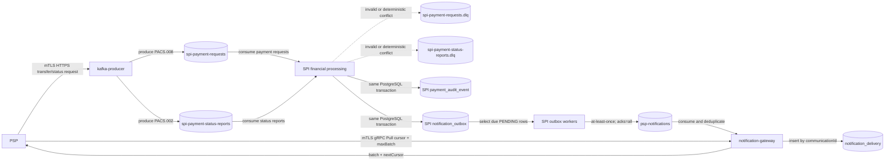

# Kafka Message Flow

This document summarizes how PSPs, Kafka, the SPI transactional outbox, and the notification gateway exchange payment messages.

```mermaid
flowchart LR
    PSP["PSP"]
    Producer["kafka-producer"]
    PaymentRequests[("spi-payment-requests")]
    StatusReports[("spi-payment-status-reports")]
    PaymentRequestsDlq[("spi-payment-requests.dlq")]
    StatusReportsDlq[("spi-payment-status-reports.dlq")]
    SPI["SPI financial processing"]
    Audit[("SPI payment_audit_event")]
    Outbox[("SPI notification_outbox")]
    Worker["SPI outbox workers"]
    Notifications[("psp-notifications")]
    Gateway["notification-gateway"]
    Delivery[("notification_delivery")]

    PSP -->|"mTLS HTTPS transfer/status request"| Producer
    Producer -->|"produce PACS.008"| PaymentRequests
    Producer -->|"produce PACS.002"| StatusReports
    PaymentRequests -->|"consume payment requests"| SPI
    StatusReports -->|"consume status reports"| SPI
    SPI -.->|"invalid or deterministic conflict"| PaymentRequestsDlq
    SPI -.->|"invalid or deterministic conflict"| StatusReportsDlq
    SPI -->|"same PostgreSQL transaction"| Audit
    SPI -->|"same PostgreSQL transaction"| Outbox
    Outbox -->|"select due PENDING rows"| Worker
    Worker -->|"at-least-once; acks=all"| Notifications
    Notifications -->|"consume and deduplicate"| Gateway
    Gateway -->|"insert by communicationId"| Delivery
    PSP -->|"mTLS gRPC Pull cursor + maxBatch"| Gateway
    Gateway -->|"batch + nextCursor"| PSP
```

## Topics

| Topic | Producer | Consumer | Payload |
| --- | --- | --- | --- |
| `spi-payment-requests` | `kafka-producer` | `spi` | Internal protobuf payment request |
| `spi-payment-status-reports` | `kafka-producer` | `spi` | Internal protobuf status report |
| `spi-payment-requests.dlq` | `spi` | Manual operation | Original failed Kafka value |
| `spi-payment-status-reports.dlq` | `spi` | Manual operation | Original failed Kafka value |
| `psp-notifications` | SPI outbox workers | `notification-gateway` | Stored opaque `BYTEA` payload routed by ISPB |

## Transport Boundary

PSPs do not consume Kafka directly. They submit messages to `kafka-producer` over mTLS HTTPS and pull SPI notifications from `notification-gateway` through unary gRPC calls over a persistent HTTP/2/mTLS connection.

Each PSP maintains one logical pull flow. A request carries only the last cursor processed durably by that PSP. When backlog is available, the Gateway immediately returns the next 10 notifications at most, in stable order, plus an opaque HMAC-authenticated `nextCursor`; when the backlog is empty, the existing long poll waits for new work or its timeout. The fixed limit of 10 is part of the protocol rather than a client or profile setting. The PSP advances its durable cursor only after processing the complete response; presenting an older cursor redelivers the corresponding rows and therefore provides at-least-once delivery without individual ACK writes, leases, or an active redelivery scheduler.

The SPI outbox and gateway delivery table protect different boundaries:

| Boundary | Durable owner | Completion evidence in that boundary |
| --- | --- | --- |
| Confirmed financial fact to Kafka publication | SPI `notification_outbox` | `PUBLISHED`: Kafka broker confirmed the send with `acks=all` |
| Kafka consumption to PSP processing | Gateway backlog + PSP cursor | PSP durably retained the last Gateway-issued cursor it fully processed |

SPI `PUBLISHED` is broker confirmation only. The Gateway does not persist PSP progress in the hot path; the PSP is authoritative for the last cursor it processed, while the Gateway is authoritative for whether that opaque cursor was genuinely issued for the authenticated PSP.

## Transactional Financial, Audit, and Outbox Write Path

For each input batch, the SPI performs three separate bulk database operations in one PostgreSQL transaction:

1. classify and apply the current financial statement;
2. insert business events for only the effective results into `payment_audit_event`;
3. insert obligations for only the effective results into `notification_outbox`.

Atomicity does not depend on placing all work in one CTE. `PaymentTransactionProcessorService` keeps the transaction open across the three statements. Audit or outbox failure rolls back payment creation, status, balances, audit rows, and obligations together.

The facts mapped to audit rows are:

- new `pacs.008`: `PAYMENT_CREATED`;
- effective status transition: `PAYMENT_STATUS_CHANGED`;
- effective settlement: `PAYMENT_STATUS_CHANGED` and `SETTLEMENT_APPLIED` in the same bulk and transaction;
- replay with an effective business change: the same normal events;
- replay or processing that results in `NOOP`: no audit event.

`event_id` is only a technical identity. There is no ordering guarantee between the status-change and settlement rows produced by the same operation.

The facts mapped to outbox rows are:

- new `pacs.008`: one `ACCEPTANCE_REQUEST` to the receiver;
- effective `REJECTED` transition: one `REJECTED_NOTIFICATION/RJCT` to the payer;
- effective settlement: `SETTLED_NOTIFICATION/ACSC` to the payer and `SETTLED_NOTIFICATION/ACCC` to the receiver.

Notification serialization uses `ObjectMapper.writeValueAsBytes(...)` before the outbox bulk insert. Failure during audit persistence, validation, serialization, or outbox insertion rolls back the financial statement, status, and bucket balances. The input Kafka acknowledgment happens after the PostgreSQL commit; it does not wait for outbox publication.

The `communication_id` primary key and `ON CONFLICT DO NOTHING` make replay idempotent at the obligation boundary. Identical `pacs.008` replay in `WAITING_ACCEPTANCE` keeps an existing `PENDING` or `PUBLISHED` row and recreates it if missing. Replay in advanced status and `pacs.002` that produces no new transition remain no-ops. There is no backfill for pre-migration payments.

## Persisted Message Contract

The business payload is created and serialized once per obligation, then persisted as `BYTEA`. Publication sends the exact stored bytes and never reloads the payment to reconstruct content.

Topic, key, and headers are deterministic and therefore not persisted:

- topic: `psp-notifications`;
- key: `recipient_ispb`;
- required headers: `notification.communication-id`, `notification.event-type`, `notification.payment-id`, and `notification.schema-version`;
- optional header: `notification.status`, reconstructed only when `notification_status` is present.

The producer uses `StringSerializer` for the key, `ByteArraySerializer` for the payload, and `acks=all`.

## Outbox Worker Flow

The scheduler runs independently in every SPI instance with these defaults:

- batch size: 1,000 due rows per instance;
- fixed delay: 20 ms;
- retry delay: one second;
- no attempt limit.

Each execution selects `PENDING` rows whose `next_attempt_at` has expired. It does not lock or claim them and holds no database transaction while contacting Kafka. It starts one asynchronous send per row before waiting for the futures, then separates successful and failed results.

Successes and failures are each updated in bulk:

- a broker-confirmed success changes a still-`PENDING` row to `PUBLISHED`, increments `attempt_count`, fills `published_at`, and clears `last_error`;
- a failed send keeps a still-`PENDING` row pending, increments `attempt_count`, sets the fixed retry time, and stores `last_error`.

Every update includes `WHERE publication_status = 'PENDING'`. A delayed failure cannot reopen a published row, while a delayed success can still publish a pending row. `PUBLISHED` is terminal.

Failure after Kafka accepts a send but before the database update leaves the row pending. A restart during selection or send has the same effect. Both cases intentionally allow republication and produce an at-least-once guarantee.

## Concurrency and Deduplication

There is no ownership, claim, lease, fencing, lock, or coordination among SPI workers. Multiple instances can select and physically publish the same row concurrently. This is accepted in the MVP.

Every duplicate carries the same `communicationId`. The notification gateway inserts delivery state with `ON CONFLICT (communication_id) DO NOTHING`, so physical Kafka duplicates produce one logical backlog row. A Gateway-owned global `delivery_position` orders committed rows independently of Kafka partitions and offsets; cursor validity therefore survives Kafka repartitioning.

The system guarantees durable obligation plus at-least-once Kafka publication. It does not guarantee exactly-once publication.

## Failure Policy

SPI DLQ behavior is documented in [Kafka DLQ Policy](KAFKA_DLQ_POLICY.md). Replay behavior is documented in [Idempotency and Replay Policy](IDEMPOTENCY_REPLAY_POLICY.md).

PostgreSQL resource failures raised while inserting notification obligations are not wrapped as notification errors. They reach the input consumer as database infrastructure failures, so the batch remains unacknowledged and follows the indefinite infrastructure retry path instead of DLQ recovery.

PostgreSQL resource failures raised by the business-audit insert follow the same path and are also not wrapped. Constraint failures remain visible and roll back the financial operation; audit inserts do not use `ON CONFLICT` to hide unexpected classification errors.

Outbox publication failure is not sent to a DLQ in this cut. The row remains `PENDING` and retries indefinitely. `PUBLISHED` rows are not deleted automatically.

## Limitações Conscientes

- Several SPI instances can select and physically publish the same message.
- Duplicate sends can increase Kafka traffic, CPU use, database activity, and gateway load.
- Workers have no ownership, claim, lease, fencing, lock, or coordination.
- `attempt_count` is approximate and does not count every concurrent physical send exactly.
- `last_error` can be overwritten by a concurrent failure and may not represent the globally latest attempt.
- A delayed failure cannot reopen terminal `PUBLISHED` state.
- `PUBLISHED` rows are retained indefinitely and the table grows continuously without retention or cleanup.
- Fixed retry can create sustained pressure during a long Kafka outage.
- There is no `DEAD` state, attempt limit, or automatic recovery path for permanently invalid messages.
- Observability is limited to logs and manual table queries; this cut adds no outbox metrics or dashboard.
- There is no exactly-once guarantee; physical duplicates are an expected consequence of at-least-once delivery.
- The Gateway retains all `notification_delivery` rows; cursor-based retention/GC is not implemented in this MVP.
- Only one pull may be active per PSP; parallel cursor shards are outside the MVP.
- Business audit starts at its migration; there is no historical backfill.
- Audit rows have no causal ordering guarantee, and `event_id` is only a technical identity.
- Audit has no retention, cleanup, partitioning, archived history, dedicated metrics, or comparative load-test gate in this cut.
- `NOOP` replay, retries, redelivery, rejected inputs, and original PACS payloads are outside the business audit.
- These simplifications are suitable for the MVP, but do not necessarily represent the final production design.

## Sinais para Evolução

Introduce claim/lease, `FOR UPDATE SKIP LOCKED`, `claim_token`, fencing, coordinated ownership, richer retry, or cleanup when one or more of these signals appears:

- physical duplicate volume or duplicate-caused Kafka traffic grows materially;
- CPU, database, or notification-gateway load caused by duplicates becomes excessive;
- workers frequently contend for the same rows;
- backlog grows with healthy Kafka, or the oldest pending-row age grows continuously;
- one active attempt per row becomes mandatory;
- automated failover, worker coordination, or duplicate-free rolling deploy becomes necessary;
- exact per-attempt diagnostics become required, or approximate `attempt_count` / `last_error` is insufficient;
- table growth requires retention, partitioning, or cleanup;
- audit-table or WAL growth materially affects PostgreSQL capacity, throughput, or latency;
- fixed retry produces a publication storm during outages;
- a terminal state, operational treatment, or `DEAD` handling becomes necessary.
