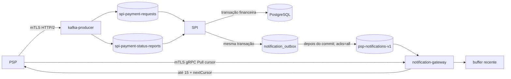

# Kafka Message Flow

## Visão geral

```mermaid
flowchart LR
    PSP[PSP]
    Ingress[kafka-producer]
    P008[(spi-payment-requests)]
    P002[(spi-payment-status-reports)]
    SPI[SPI]
    DB[(PostgreSQL)]
    Outbox[(notification_outbox)]
    NotificationLog[(psp-notifications-v1)]
    Gateway[notification-gateway]
    Memory[buffer recente]

    PSP -->|mTLS HTTP/2| Ingress
    Ingress --> P008
    Ingress --> P002
    P008 --> SPI
    P002 --> SPI
    SPI -->|transação financeira| DB
    SPI -->|mesma transação| Outbox
    Outbox -->|depois do commit; acks=all| NotificationLog
    NotificationLog --> Gateway
    Gateway --> Memory
    PSP -->|mTLS gRPC Pull cursor| Gateway
    Gateway -->|até 15 + nextCursor| PSP
```

## Tópicos

| Tópico | Producer | Consumer | Contrato |
| --- | --- | --- | --- |
| `spi-payment-requests` | `kafka-producer` | SPI | requisição interna de pagamento |
| `spi-payment-status-reports` | `kafka-producer` | SPI | status interno do PSP recebedor |
| `spi-payment-requests.dlq` | SPI | operação manual | entrada original inválida/conflitante |
| `spi-payment-status-reports.dlq` | SPI | operação manual | status original inválido/conflitante |
| `psp-notifications-v1` | SPI | Gateway e leitura histórica | log durável da notificação completa |

## Processamento financeiro

O SPI aplica cada batch em uma transação PostgreSQL:

1. classifica e aplica pagamento, status e saldo;
2. insere somente os fatos efetivos em `payment_audit_event`;
3. insere somente as notificações efetivas em `notification_outbox`.

Pagamento, auditoria e outbox fazem commit ou rollback juntos. Replays que não
adquirem uma nova transição não criam auditoria nem notificação.

As notificações são agrupadas por destinatário e serializadas em envelopes de
até 15 itens. A row persistida contém `communication_id`, `recipient_ispb`, os
bytes finais do payload e `created_at`.

## Publicação confiável

Depois do commit, o lote entra em uma fila limitada do SPI. Um único publisher
envia os bytes persistidos ao `psp-notifications-v1`, usando:

- key: `recipient_ispb`;
- header: `notification.communication-id`;
- value: payload opaco já persistido;
- producer idempotente, `acks=all`, compressão LZ4.

A outbox é apagada somente após a confirmação de todas as mensagens do lote.
Falha parcial, confirmação inconclusiva ou falha no delete repete o lote
completo. Ao reiniciar, o SPI drena rows residuais antes de habilitar os
consumidores de pagamentos.

Não existe scan periódico da outbox. A presença da row significa "a obrigação
ainda não foi confirmada pelo Kafka"; sua ausência significa "o broker aceitou
a mensagem", não "o PSP já a processou".

## Log durável e Pull

`psp-notifications-v1` tem exatamente 8 partições e retenção de 7 dias. A key
por ISPB mantém um PSP em uma única partição desta geração.

O Gateway acompanha o tópico e mantém uma janela contígua, limitada e
compartilhada por partição. Um Pull coberto por essa janela usa apenas memória.
Em restart, eviction ou lacuna, o Gateway busca diretamente a partir do offset
no Kafka e responde sem criar uma segunda persistência.

O cursor HMAC vincula PSP, geração do tópico, partição e último offset
examinado. Ele avança também sobre records de outros PSPs da mesma partição,
mas somente mensagens cuja key é o PSP autenticado são devolvidas. Cada item
retornado contém payload e `communication_id` para idempotência no PSP.

O PSP persiste o novo cursor apenas depois de processar duravelmente o lote
inteiro. Reusar o cursor anterior repete o lote e fornece semântica
at-least-once sem ACK individual, lease, `IN_FLIGHT`, retry scheduler,
`delivery_index` ou reconciliação PostgreSQL.

Detalhes e limitações estão em [Entrega durável de notificações pelo Kafka](architecture/kafka-durable-notification-delivery.md).

## Falhas

- Falha do PostgreSQL reverte o fato financeiro e sua notificação.
- Falha do Kafka mantém a outbox e aplica backpressure/retry no publisher.
- Queda do SPI antes de publicar é recuperada pela outbox no startup.
- Queda do Gateway não perde progresso: o PSP reapresenta o cursor e o Gateway
  lê o Kafka.
- Queda do PSP antes de persistir o cursor pode repetir o lote.
- Cursor anterior à retenção falha explicitamente e exige recuperação
  operacional.

## Limites do MVP

O ambiente local usa um broker e replication factor 1. O processo e o contrato
são exercitados, mas HA de broker, host e volume ficam para uma etapa própria.
A retenção operacional é de 7 dias; períodos maiores pertencem a disaster
recovery. O SPI ainda não bloqueia novo ingresso com base na saúde do transporte.
