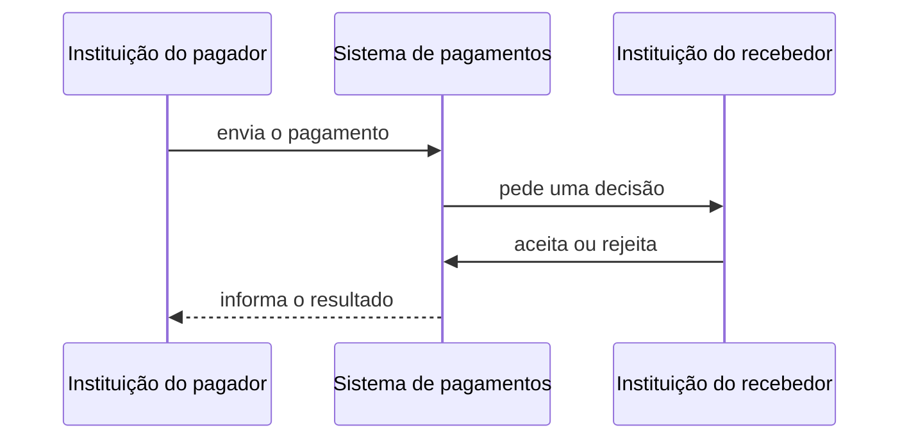

# Como o sistema funciona

Este documento mostra o sistema por dentro: quem decide o que acontece com o dinheiro, como o resultado sobrevive a uma falha e por que o trabalho foi dividido entre componentes diferentes.

O objetivo é entender o desenho como um todo. Locks, SQL, formatos de mensagem e outros detalhes de implementação ficam nos documentos de aprofundamento.

## A jornada do pagamento

Duas instituições participam do fluxo: a do pagador e a do recebedor.

Quando o pedido chega, o sistema verifica se o pagador possui saldo. Se não houver, rejeita o pagamento imediatamente.

Se houver, o valor é reservado antes de consultar o recebedor. Isso impede que outro pagamento gaste o mesmo dinheiro durante a espera.

O recebedor então decide:

* se aceitar, recebe o valor reservado;
* se rejeitar, o valor volta à disponibilidade do pagador.

Por fim, o resultado retorna às instituições envolvidas.

## Onde cada parte entra

O **Payment Ingress** recebe e autentica as mensagens. Sua resposta diz apenas que o pedido entrou no sistema; ela ainda não diz se o pagamento deu certo.

O **Payment Processor** é a autoridade sobre pagamentos e movimentações financeiras. É nele que o saldo é reservado, creditado ou devolvido.

O **PostgreSQL** guarda pagamentos, saldos e o histórico de auditoria. Ele também permite confirmar juntas todas as mudanças produzidas pelo mesmo pagamento.

O **Kafka** conecta componentes que trabalham em ritmos diferentes e mantém as mensagens disponíveis enquanto elas atravessam o fluxo.

O **Notification Gateway** oferece às instituições uma forma de recuperar pedidos e resultados sem transferir essa responsabilidade para o processador financeiro.

## O que esse desenho precisa preservar

### E se o mesmo pagamento chegar novamente?

Mensagens podem se repetir depois de uma falha de comunicação ou de uma nova tentativa. O sistema reconhece que aquele pagamento já existe e preserva seu resultado. A mensagem pode aparecer novamente; o dinheiro não se move novamente.

### E se dois pagamentos tentarem usar o mesmo saldo?

O PostgreSQL estabelece uma ordem entre pagamentos que disputam o dinheiro da mesma instituição. Essa espera existe somente onde há uma disputa real pelo mesmo saldo; instituições independentes continuam avançando separadamente.

### E se alguma coisa falhar no meio?

Estado do pagamento, movimentação financeira, registro de auditoria e obrigação de informar o resultado são confirmados na mesma transação.

Assim, o sistema não confirma um pagamento sem mover o dinheiro correspondente, nem move o dinheiro sem guardar a obrigação de informar o resultado.

### E se o pagamento terminar, mas a confirmação não chegar?

A obrigação de enviar a confirmação é gravada no PostgreSQL junto com o pagamento. Depois que essa transação termina, ela é publicada no Kafka. Esse padrão é conhecido como **transactional outbox**.

Kafka mantém um histórico recente das confirmações. As instituições consultam esse histórico pelo Notification Gateway e informam até onde já o processaram por meio de um cursor.

Se uma instituição cair antes de terminar um lote, pode receber as mesmas mensagens novamente. A entrega é **at-least-once**: repetir é permitido; perder silenciosamente não.

## Quem é responsável por cada informação?

| Informação | Autoridade |
| --- | --- |
| pagamentos, saldos e auditoria | PostgreSQL |
| criação da obrigação de notificar | PostgreSQL / outbox |
| notificações publicadas e recuperáveis | Kafka |
| progresso já processado | a própria instituição |
| acesso ao histórico | Notification Gateway |

Essa separação evita duas partes diferentes tentando decidir a mesma coisa. Kafka não decide o estado do dinheiro, o Gateway não inventa o progresso de uma instituição e PostgreSQL não precisa acompanhar cada entrega individual.

## Nem toda falha pede a mesma resposta

O sistema distingue resultados normais de negócio, mensagens inválidas e falhas de infraestrutura.

Saldo insuficiente é um resultado normal do pagamento. Uma mensagem inválida é separada para não bloquear as seguintes. Se a infraestrutura estiver temporariamente indisponível, o trabalho permanece disponível para uma nova tentativa.

Essa distinção evita tanto uma repetição infinita quanto o descarte de algo que ainda poderia ser concluído.

## Para entender os mecanismos

Cada documento abaixo responde a uma pergunta específica:

* [Corretude do pagamento](topics/payment-correctness.md): como identidade, reserva, concorrência e transações preservam o dinheiro?
* [Entrega recuperável de notificações](topics/notification-delivery.md): como outbox, Kafka, cursor e Pull mantêm a confirmação disponível?
* [Tratamento de falhas](topics/failure-handling.md): como entradas inválidas, indisponibilidade, retry e DLQ são classificados?

## O que este desenho ainda não cobre

O sistema foi construído e testado dentro de alguns limites deliberados:

* uma instância de cada serviço e um broker Kafka com fator de replicação 1;
* nenhuma qualificação de escala horizontal, multi-região ou Kubernetes;
* sete dias de retenção operacional das notificações;
* nenhum timeout automático para pagamentos que aguardam a decisão do recebedor;
* rejeição imediata por saldo insuficiente, sem fila de liquidez;
* uma confirmação que não entra no caminho de publicação logo após o commit só é redescoberta na próxima inicialização.

A [evolução da engenharia](engineering-evolution.md) mostra como os problemas encontrados durante o projeto levaram a essas decisões.
