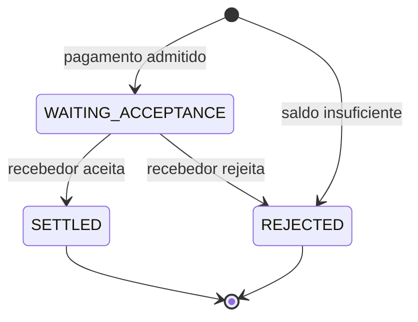

# System Design

O README apresenta o fluxo pelo ponto de vista de quem faz um pagamento. Aqui a pergunta é outra:

> O que o sistema precisa garantir para esse fluxo continuar correto quando aparecem duplicidade, concorrência e falhas?

No desenho atual, quase tudo gira em torno de duas garantias:

1. o pagamento e a movimentação do dinheiro precisam concluir juntos e corretamente;
2. depois disso, a confirmação precisa permanecer recuperável até chegar às instituições.

O PostgreSQL protege a primeira. Kafka e o Notification Gateway cuidam da segunda.

## O modelo do pagamento

O sistema trabalha com um fluxo pequeno de estados:



Quando uma instituição envia um novo pagamento, ela usa uma mensagem `pacs.008`. A identidade da instituição vem do certificado mTLS usado no ingresso, e somente a instituição da conta pagadora pode iniciar aquele pagamento.

Se houver saldo disponível, o pagamento entra em `WAITING_ACCEPTANCE`. Nesse momento, o valor já deixa de estar disponível para outros pagamentos.

O recebedor recebe a solicitação e responde com uma `pacs.002`. Somente a instituição recebedora daquele pagamento pode decidir seu resultado.

Se aceitar, o pagamento vai para `SETTLED` e o recebedor é creditado.

Se rejeitar, o pagamento vai para `REJECTED` e o valor volta a ficar disponível para o pagador.

Se não houver saldo suficiente já no início, o pagamento é rejeitado imediatamente e nunca entra em `WAITING_ACCEPTANCE`.

Essa ordem é deliberada: o dinheiro é comprometido antes de pedir a decisão do recebedor.

## O dinheiro tem uma única autoridade

Cada instituição possui um único saldo disponível no PostgreSQL.

Não existe uma segunda tabela de reservas. A própria combinação entre o estado do pagamento e o saldo representa a reserva:

```text
payment = WAITING_ACCEPTANCE
        ↓
o valor daquele pagamento já saiu do saldo disponível do pagador
```

Isso cria três regras financeiras simples:

| Situação            | Efeito                                               |
| ------------------- | ---------------------------------------------------- |
| pagamento admitido  | retira o valor da disponibilidade do pagador         |
| recebedor aceita    | credita o recebedor                                   |
| recebedor rejeita   | devolve o valor à disponibilidade do pagador          |

O pagador não é debitado novamente quando o recebedor aceita: isso já aconteceu quando o pagamento entrou em `WAITING_ACCEPTANCE`.

Essa escolha evita que dois pagamentos usem o mesmo dinheiro enquanto aguardam uma resposta. Também mantém a transição final pequena: aceitar significa creditar o recebedor; rejeitar significa devolver o valor reservado.

O banco também impede que um saldo fique negativo.

## Quando o mesmo pagamento aparece novamente

Uma segunda tentativa não pode significar uma segunda transferência.

Cada pagamento possui uma identidade lógica (`paymentId` / `EndToEndId`) e uma representação normalizada de seu conteúdo.

Quando uma requisição chega, o sistema distingue três situações:

| Caso                                      | Comportamento                                            |
| ----------------------------------------- | -------------------------------------------------------- |
| identidade nova                           | o pagamento entra normalmente no fluxo                  |
| mesma identidade e mesmo conteúdo         | a repetição não produz novo efeito                       |
| mesma identidade e conteúdo diferente     | a mensagem é tratada como conflito e enviada para a DLQ  |

No segundo caso, nenhum saldo muda novamente, nenhum novo fato de auditoria é criado e nenhuma nova obrigação de notificação nasce apenas porque a mesma mensagem reapareceu.

Isso também vale quando duas cópias chegam concorrentemente: somente uma consegue estabelecer o pagamento como novo.

A mesma regra se aplica à resposta do recebedor. Repetir a mesma decisão depois que a transição já aconteceu não credita nem devolve dinheiro novamente. Uma decisão incompatível com o estado existente é tratada como conflito.

A garantia é lógica, não física: Kafka ou o mecanismo de entrega podem repetir mensagens. O que não pode se repetir é o efeito financeiro correspondente.

## Quando dois pagamentos usam a mesma conta

Duplicidade não é o único problema. Dois pagamentos diferentes podem tentar gastar o mesmo saldo ao mesmo tempo.

Por isso, o PostgreSQL também funciona como mecanismo de serialização financeira.

Antes de decidir quais pagamentos cabem no saldo de uma instituição, a transação bloqueia sua linha de saldo. Enquanto essa decisão está em andamento, outra transação que precise alterar o mesmo saldo espera.

Dentro de um mesmo lote, os pagamentos de uma conta são avaliados em ordem determinística.

Por exemplo:

```text
saldo disponível = 100

pagamento de 80 → entra
pagamento de 50 → rejeita por saldo insuficiente
pagamento de 10 → entra
```

O fato de o pagamento de 50 não caber não impede o pagamento de 10 de usar o saldo restante.

O mesmo princípio vale na conclusão: aceites creditam os recebedores e rejeições devolvem o valor reservado enquanto as linhas necessárias permanecem protegidas.

Essa contenção é intencional. Se duas operações disputam o mesmo dinheiro, alguma ordem precisa existir entre elas.

## O pagamento não pode ficar pela metade

Alterar o dinheiro é apenas uma parte do que significa concluir uma transição.

Quando um pagamento muda, quatro coisas pertencem ao mesmo fato de negócio:

```text
estado do pagamento
movimentação financeira
auditoria
obrigação de enviar a confirmação
```

Essas mudanças compartilham a mesma transação PostgreSQL.

Por exemplo, ao aceitar um pagamento:

```text
WAITING_ACCEPTANCE → SETTLED
+
crédito do recebedor
+
PAYMENT_SETTLED na auditoria
+
confirmações que precisam ser publicadas
```

Ou todas essas mudanças são persistidas, ou nenhuma é.

Isso evita situações como:

- o pagamento aparecer como concluído sem o dinheiro ter chegado;
- o dinheiro mudar sem o estado correspondente;
- o pagamento concluir sem existir uma obrigação durável de informar os participantes;
- a auditoria registrar um fato que não chegou a acontecer.

A mesma propriedade vale para a entrada e para a rejeição.

A auditoria registra apenas fatos efetivamente aplicados. Uma repetição que não produz mudança também não cria um novo evento de negócio.

## Concluir o pagamento não significa entregar a confirmação

Até aqui, o PostgreSQL consegue tornar as mudanças do pagamento atômicas.

O problema seguinte começa justamente onde essa transação termina:

> Como garantir que uma confirmação não seja perdida ao atravessar do PostgreSQL para o Kafka?

Uma publicação no Kafka não pode participar da mesma transação que altera pagamentos e saldos.

O sistema resolve essa diferença com uma transactional outbox:

```text
transação PostgreSQL
├── pagamento
├── saldos
├── auditoria
└── notification_outbox
            │
            │ depois do commit
            ▼
          Kafka
```

A outbox guarda a confirmação que precisa ser publicada.

Depois do commit, o SPI publica essa informação no Kafka. A linha só é removida da outbox depois que o broker confirma as mensagens correspondentes.

Se o processo cair antes da publicação, a obrigação continua registrada no banco e pode ser recuperada depois da reinicialização.

Se o resultado de uma publicação for inconclusivo, o lote pode ser enviado novamente.

Essa escolha privilegia uma propriedade específica:

> Uma confirmação pode aparecer mais de uma vez; ela não pode ser simplesmente esquecida depois que o pagamento foi confirmado.

## Kafka preserva as confirmações para entrega

Depois que a publicação é confirmada, o Kafka passa a ser a fonte durável das confirmações disponíveis para entrega.

O desenho evita manter um segundo banco com o estado individual de cada entrega.

As responsabilidades ficam separadas:

| Responsabilidade                              | Autoridade                |
| --------------------------------------------- | ------------------------- |
| estado do pagamento e saldos                  | PostgreSQL                |
| criação atômica da obrigação de notificar     | PostgreSQL / outbox       |
| confirmações disponíveis para recuperação     | Kafka                     |
| progresso de processamento                    | instituição participante  |
| protocolo de leitura                          | Notification Gateway      |

O tópico de notificações mantém sete dias de histórico.

As instituições consultam o Notification Gateway usando um cursor que representa até onde já processaram. Esse cursor é autenticado e vinculado à instituição que o recebeu.

A instituição só avança o cursor depois de processar duravelmente o lote recebido.

Se ela falhar antes disso, reutiliza o cursor anterior e pode receber as mesmas mensagens novamente.

Por isso, a entrega é at-least-once: o sistema não promete exatamente uma entrega física de cada mensagem.

Em vez disso, cada confirmação possui uma identidade estável (`communicationId`). Assim, uma repetição pode ser reconhecida sem produzir novamente seu efeito lógico.

O Gateway mantém uma janela recente em memória para acelerar o caminho normal, mas essa memória não é a autoridade. Depois de uma reinicialização, ou quando o cursor aponta para algo mais antigo, o histórico é recuperado novamente do Kafka.

## Por que essas autoridades são separadas

Uma decisão importante do desenho é não pedir para uma única tecnologia resolver problemas diferentes.

```text
PostgreSQL
→ quem possui o dinheiro?
→ em que estado está o pagamento?
→ qual obrigação nasceu junto com essa mudança?

Kafka
→ quais confirmações ainda podem ser recuperadas?

Instituição participante
→ até onde eu já processei?

Notification Gateway
→ como eu acesso esse histórico?
```

Cada componente possui uma autoridade explícita, e nenhuma informação mantida apenas em memória é necessária para recuperar o estado correto.

Isso evita transformar o PostgreSQL em um sistema de acompanhamento de entregas ou o Kafka em autoridade sobre dinheiro e estado financeiro.

## O que o desenho não tenta resolver

Alguns limites são deliberados:

- o núcleo qualificado usa uma única instância de cada serviço;
- o Kafka local usa um broker e fator de replicação 1; o protocolo de recuperação é exercitado, mas a alta disponibilidade do broker não é;
- as confirmações permanecem disponíveis no fluxo operacional por sete dias; recuperações além dessa janela pertencem aos mecanismos de recuperação de desastre;
- um pagamento em `WAITING_ACCEPTANCE` não possui timeout automático; um recebedor que nunca responde pode manter dinheiro reservado;
- o desenho não qualifica escala horizontal, operação multi-região ou Kubernetes;
- insuficiência de saldo rejeita o pagamento imediatamente; não existe fila de liquidez.

Esses limites delimitam o que o desenho atual pretende demonstrar.

Dentro deles, o foco permanece nas propriedades centrais de corretude financeira, idempotência, atomicidade e entrega recuperável.
