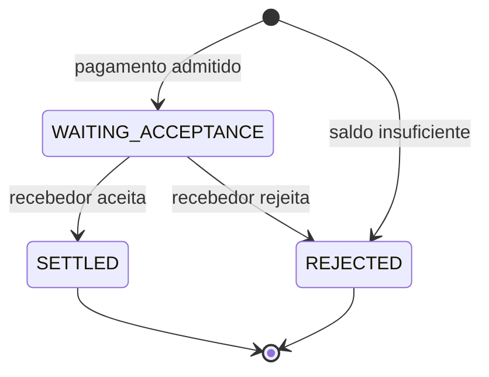

# System Design

O README apresenta o fluxo pelo ponto de vista de quem faz um pagamento. Aqui a pergunta é outra:

> **O que o sistema precisa fazer para esse fluxo continuar correto quando aparecem duplicidade, concorrência e falhas?**

No desenho atual, quase tudo gira em torno de duas fronteiras:

1. **concluir corretamente o pagamento e a movimentação do dinheiro;**
2. **garantir que a confirmação desse pagamento ainda consiga chegar às instituições depois.**

O PostgreSQL protege a primeira. Kafka e o Notification Gateway cuidam da segunda.

## O modelo do pagamento

O sistema trabalha com um fluxo pequeno de estados:



Quando uma instituição envia um novo pagamento, ela usa uma mensagem `pacs.008`. A identidade da instituição vem do certificado mTLS usado no ingresso, e somente a instituição da conta pagadora pode iniciar aquele pagamento.

Se houver saldo disponível, o pagamento entra em `WAITING_ACCEPTANCE`. Nesse momento o valor já deixa de estar disponível para outros pagamentos.

O recebedor então recebe a solicitação e responde com uma `pacs.002`. Somente a instituição recebedora daquele pagamento pode decidir seu resultado.

Se aceitar, o pagamento vai para `SETTLED` e o recebedor é creditado.

Se rejeitar, o pagamento vai para `REJECTED` e o valor volta a ficar disponível para o pagador.

Se não houver saldo já no início, o pagamento é rejeitado imediatamente e nunca entra em `WAITING_ACCEPTANCE`.

Essa ordem é deliberada: o dinheiro é comprometido antes de pedir a decisão do recebedor.

## O dinheiro tem uma única autoridade

Cada instituição possui um único saldo disponível no PostgreSQL.

```text
institution
└── available balance
```

Não existe uma segunda tabela de reservas. A própria combinação entre o estado do pagamento e o saldo representa a reserva:

```text
payment = WAITING_ACCEPTANCE
        ↓
o valor daquele pagamento já saiu do saldo disponível do pagador
```

Isso cria três regras financeiras simples:

| Situação           | Efeito                                       |
| ------------------ | -------------------------------------------- |
| pagamento admitido | retira o valor da disponibilidade do pagador |
| recebedor aceita   | credita o recebedor                          |
| recebedor rejeita  | devolve o valor à disponibilidade do pagador |

O pagador não é debitado novamente quando o recebedor aceita: isso já aconteceu quando o pagamento entrou.

Essa escolha evita que dois pagamentos usem o mesmo dinheiro enquanto aguardam uma resposta e mantém a liquidação final pequena: aceitar significa apenas creditar o recebedor; rejeitar significa apenas devolver a reserva.

O banco também impede que um saldo fique negativo.

## Quando o mesmo pagamento aparece novamente

Uma segunda tentativa não pode significar uma segunda transferência.

Cada pagamento possui uma identidade lógica (`paymentId` / `EndToEndId`) e uma representação normalizada de seu conteúdo.

Quando uma nova requisição chega, o sistema distingue três situações:

### É um pagamento novo

Ele pode entrar normalmente no fluxo e produzir seus efeitos financeiros.

### É exatamente o mesmo pagamento

A repetição vira um **no-op**.

Nenhum saldo muda novamente. Nenhum novo fato de auditoria é criado. Nenhuma segunda obrigação de notificação nasce apenas porque a mensagem apareceu de novo.

Isso vale também quando duas cópias chegam concorrentemente: somente uma delas consegue estabelecer o pagamento como novo.

### A identidade é a mesma, mas o conteúdo mudou

Isso não é tratado como uma repetição válida.

O sistema classifica a mensagem como conflito e a envia para a DLQ, sem alterar o pagamento já existente.

A mesma ideia vale para a resposta do recebedor. Repetir a mesma decisão depois que a transição já aconteceu não credita nem devolve dinheiro novamente. Uma decisão incompatível com o estado existente é tratada como conflito.

A garantia é lógica, não física: Kafka ou a entrega ao participante podem repetir mensagens. O que não pode se repetir é o efeito financeiro correspondente.

## Quando dois pagamentos usam a mesma conta

Duplicidade não é o único problema. Dois pagamentos diferentes podem tentar gastar o mesmo saldo ao mesmo tempo.

Por isso, o PostgreSQL também funciona como mecanismo de serialização financeira.

Antes de decidir quais pagamentos cabem no saldo de uma instituição, a transação bloqueia sua linha de saldo. Enquanto aquele saldo está sendo decidido, outra transação que precise alterá-lo espera.

Dentro de um mesmo lote, os pagamentos de uma conta são avaliados em ordem determinística.

Por exemplo:

```text
saldo disponível = 100

pagamento de 80 → entra
pagamento de 50 → rejeita por saldo insuficiente
pagamento de 10 → entra
```

O fato de o pagamento de 50 não caber não impede o de 10 de usar o saldo restante.

Os débitos são calculados por pagamento, mas o banco pode aplicar a alteração física de forma agregada por instituição.

O mesmo princípio aparece no resultado: aceites creditam os recebedores e rejeições devolvem reservas aos pagadores enquanto as linhas necessárias permanecem protegidas.

Essa contenção é intencional. Se duas operações realmente disputam o mesmo dinheiro, alguma ordem precisa existir entre elas.

## O pagamento não pode ficar pela metade

Alterar o dinheiro é apenas uma parte do que significa concluir uma transição.

Quando um pagamento muda, quatro coisas pertencem ao mesmo fato de negócio:

```text
estado do pagamento
movimentação financeira
auditoria
obrigação de enviar a confirmação
```

Essas mudanças compartilham a mesma transação PostgreSQL.

Por exemplo, ao aceitar um pagamento:

```text
WAITING_ACCEPTANCE → SETTLED
+
crédito do recebedor
+
PAYMENT_SETTLED na auditoria
+
confirmações que precisam ser publicadas
```

Ou tudo confirma, ou tudo é revertido.

Isso evita situações como:

* o pagamento aparecer como concluído sem o dinheiro ter chegado;
* o dinheiro mudar sem o estado correspondente;
* o pagamento concluir sem existir uma obrigação durável de informar os participantes;
* uma auditoria registrar um fato que não chegou a acontecer.

O mesmo vale para a entrada e para a rejeição.

A auditoria registra apenas fatos efetivamente aplicados. Uma repetição que não muda nada também não cria um novo evento de negócio.

## Concluir o pagamento não significa entregar a confirmação

Existe uma fronteira importante depois do commit financeiro.

O PostgreSQL consegue garantir que a **obrigação de enviar a confirmação** nasceu junto com o pagamento, mas não consegue tornar uma publicação Kafka parte da mesma transação.

O sistema resolve isso com uma transactional outbox:

```text
transação PostgreSQL
├── pagamento
├── saldos
├── auditoria
└── notification_outbox
            │
            │ depois do commit
            ▼
          Kafka
```

A outbox guarda o payload que precisa ser publicado.

Depois do commit, o SPI envia esse payload ao Kafka. A linha só é removida da outbox depois que o broker confirma todas as mensagens correspondentes.

Se o processo cair antes de publicar, a linha continua no banco e é recuperada no próximo startup.

Se a publicação for inconclusiva, o lote pode ser enviado novamente.

Essa escolha favorece uma propriedade específica:

> **uma confirmação pode aparecer mais de uma vez; ela não pode ser simplesmente esquecida depois que o pagamento confirmou.**

## Kafka é o histórico de entrega

Depois que a publicação é confirmada, o Kafka passa a ser a fonte durável para a entrega da confirmação.

O desenho evita manter um segundo banco com o estado de cada entrega.

As responsabilidades ficam separadas:

| Responsabilidade                          | Autoridade               |
| ----------------------------------------- | ------------------------ |
| estado do pagamento e saldos              | PostgreSQL               |
| criação atômica da obrigação de notificar | PostgreSQL / outbox      |
| histórico disponível para entrega         | Kafka                    |
| progresso de consumo                      | instituição participante |
| protocolo de leitura                      | Notification Gateway     |

O tópico de notificações mantém sete dias de histórico.

As instituições consultam o Notification Gateway usando um cursor que representa até onde já processaram. O cursor é autenticado e vinculado à instituição que o recebeu.

A instituição só avança esse cursor depois de processar duravelmente o lote recebido.

Se ela cair antes disso, reutiliza o cursor anterior e pode receber as mesmas mensagens novamente.

Por isso, a entrega é **at-least-once**.

O sistema não promete exatamente uma entrega física de cada mensagem. Em vez disso, cada confirmação possui uma identidade estável (`communicationId`), permitindo que uma repetição seja reconhecida sem aplicar novamente seu efeito lógico.

O Gateway mantém uma janela recente em memória para acelerar o caminho normal, mas essa memória não é a autoridade. Depois de uma reinicialização ou quando o cursor aponta para algo mais antigo, ele volta ao Kafka.

## Por que essas autoridades são separadas

Uma decisão importante do desenho atual é não pedir para uma única tecnologia resolver todos os problemas.

```text
PostgreSQL
→ quem possui o dinheiro?
→ em que estado está o pagamento?
→ qual obrigação nasceu junto com essa mudança?

Kafka
→ quais confirmações ainda podem ser recuperadas?

Instituição participante
→ até onde eu já processei?

Notification Gateway
→ como eu acesso esse histórico?
```

Isso mantém as responsabilidades explícitas.

O PostgreSQL não precisa acompanhar leases, ACKs e tentativas individuais de entrega.

O Kafka não decide nada sobre dinheiro.

O Gateway não precisa reconstruir um banco próprio de notificações.

E memória continua sendo apenas uma otimização.

## O que o desenho não tenta resolver

Alguns limites são deliberados.

* O core qualificado usa uma única instância de cada serviço.
* O Kafka local usa um broker e replication factor 1; o protocolo de recuperação é exercitado, mas alta disponibilidade do broker não é.
* As confirmações ficam disponíveis no fluxo operacional por sete dias. Recuperações além dessa janela pertencem a disaster recovery.
* Um pagamento em `WAITING_ACCEPTANCE` não possui timeout automático; um recebedor que nunca responde pode manter dinheiro reservado.
* O desenho não qualifica escala horizontal, multi-região ou Kubernetes.
* Insuficiência de saldo rejeita o pagamento imediatamente; não existe fila de liquidez.

Esses limites mantêm o problema pequeno o suficiente para o objetivo do projeto sem remover as propriedades que a implementação decidiu preservar.
