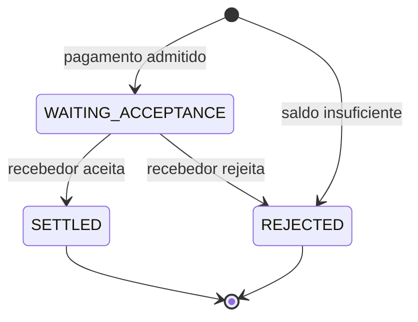

# System Design

O README apresenta o fluxo pelo ponto de vista de quem faz um pagamento. Aqui o foco é outro:

> O que o sistema precisa garantir para esse fluxo continuar correto quando aparecem duplicidade, concorrência e falhas?

O desenho se apoia em duas garantias principais:

1. o estado do pagamento e a movimentação do dinheiro precisam mudar juntos e corretamente;
2. depois que essa mudança acontece, a confirmação precisa continuar recuperável até chegar às instituições.

O PostgreSQL é a autoridade sobre pagamentos e dinheiro. A outbox conecta essa transação ao Kafka sem criar uma janela em que uma confirmação possa ser esquecida. Depois da publicação, o Kafka mantém as confirmações disponíveis para recuperação, enquanto cada instituição controla até onde já processou.

| Responsabilidade                          | Autoridade               |
| ----------------------------------------- | ------------------------ |
| Estado do pagamento e saldos              | PostgreSQL               |
| Obrigação de publicar uma confirmação     | PostgreSQL / outbox      |
| Confirmações disponíveis para recuperação | Kafka                    |
| Progresso já processado                   | Instituição participante |
| Acesso ao histórico                       | Notification Gateway     |

As seções a seguir mostram como essas responsabilidades se encaixam.

## 1. Fluxo de um pagamento

O pagamento passa por poucos estados:



Uma instituição inicia um pagamento enviando uma `pacs.008`.

A identidade da instituição vem do certificado mTLS usado no ingresso. Somente a instituição da conta pagadora pode iniciar aquele pagamento.

Se houver saldo suficiente, o pagamento entra em `WAITING_ACCEPTANCE`. Nesse momento, o valor já deixa de estar disponível para outros pagamentos.

O recebedor recebe a solicitação e responde com uma `pacs.002`. Somente a instituição recebedora pode decidir o resultado daquele pagamento.

Se aceitar, o pagamento vai para `SETTLED` e o recebedor é creditado.

Se rejeitar, o pagamento vai para `REJECTED` e o valor reservado volta a ficar disponível para o pagador.

Se não houver saldo suficiente desde o início, o pagamento é rejeitado imediatamente e nunca entra em `WAITING_ACCEPTANCE`.

Essa ordem é intencional: o dinheiro é comprometido antes de pedir a decisão do recebedor.

## 2. Corretude financeira

### Saldo e reserva

Cada instituição possui um único saldo disponível no PostgreSQL.

Não existe uma segunda tabela representando reservas. A própria combinação entre o estado do pagamento e o saldo disponível representa essa reserva:

```text
payment = WAITING_ACCEPTANCE
        ↓
o valor daquele pagamento já saiu
do saldo disponível do pagador
```

Isso produz três regras financeiras:

| Situação           | Efeito                                       |
| ------------------ | -------------------------------------------- |
| pagamento admitido | retira o valor da disponibilidade do pagador |
| recebedor aceita   | credita o recebedor                          |
| recebedor rejeita  | devolve o valor à disponibilidade do pagador |

Quando o recebedor aceita, o pagador não é debitado novamente. Esse valor já havia deixado sua disponibilidade quando o pagamento entrou em `WAITING_ACCEPTANCE`.

Essa escolha impede que dois pagamentos usem o mesmo dinheiro enquanto aguardam resposta. Também mantém a transição final simples: aceitar significa creditar o recebedor; rejeitar significa devolver o valor reservado.

O banco também impede que um saldo fique negativo.

### Idempotência

Uma segunda cópia da mesma mensagem não pode significar uma segunda transferência.

Cada pagamento possui uma identidade lógica (`paymentId` / `EndToEndId`) e uma representação normalizada de seu conteúdo.

Quando uma requisição chega, há três casos:

| Caso                                  | Comportamento                                           |
| ------------------------------------- | ------------------------------------------------------- |
| identidade nova                       | o pagamento entra normalmente no fluxo                  |
| mesma identidade e mesmo conteúdo     | a repetição não produz novo efeito                      |
| mesma identidade e conteúdo diferente | a mensagem é tratada como conflito e enviada para a DLQ |

No segundo caso, nenhum saldo muda novamente, nenhum novo fato de auditoria é criado e nenhuma nova obrigação de notificação nasce apenas porque a mensagem reapareceu.

A mesma regra vale quando duas cópias chegam ao mesmo tempo: apenas uma consegue estabelecer o pagamento como novo.

Isso também se aplica à resposta do recebedor. Repetir a mesma decisão depois que a transição já aconteceu não credita nem devolve dinheiro novamente. Uma decisão incompatível com o estado existente é tratada como conflito.

A garantia aqui é lógica, não física: mensagens podem aparecer mais de uma vez. O efeito financeiro correspondente não pode acontecer mais de uma vez.

### Concorrência

Duplicidade não é o único risco. Dois pagamentos diferentes também podem tentar gastar o mesmo saldo ao mesmo tempo.

Por isso, o PostgreSQL funciona como mecanismo de serialização financeira.

Antes de decidir quais pagamentos cabem no saldo de uma instituição, a transação bloqueia a linha desse saldo. Enquanto a decisão está em andamento, outra transação que precise alterar o mesmo valor espera.

Dentro de um mesmo lote, os pagamentos de uma conta são avaliados em ordem determinística.

Por exemplo:

```text
saldo disponível = 100

pagamento de 80 → entra
pagamento de 50 → rejeita por saldo insuficiente
pagamento de 10 → entra
```

O pagamento de 50 não caber não impede o pagamento de 10 de usar o saldo restante.

O mesmo princípio vale na conclusão: aceites creditam os recebedores e rejeições devolvem o valor reservado enquanto as linhas necessárias permanecem protegidas.

Essa contenção é intencional. Se duas operações disputam o mesmo dinheiro, alguma ordem precisa existir entre elas.

### Atomicidade

Proteger o saldo não é suficiente. Uma transição de pagamento envolve mais de uma mudança que precisa representar o mesmo fato de negócio:

```text
estado do pagamento
+
movimentação financeira
+
auditoria
+
obrigação de enviar a confirmação
```

Essas mudanças acontecem na mesma transação PostgreSQL.

Ao aceitar um pagamento, por exemplo:

```text
WAITING_ACCEPTANCE → SETTLED
+
crédito do recebedor
+
PAYMENT_SETTLED na auditoria
+
confirmações que precisam ser publicadas
```

Ou todas essas mudanças são persistidas, ou nenhuma é.

Isso evita estados parciais, como:

* o pagamento aparecer como concluído sem o dinheiro ter chegado;
* o dinheiro mudar sem o estado correspondente;
* o pagamento concluir sem existir uma obrigação durável de informar os participantes;
* a auditoria registrar algo que não chegou a acontecer.

A mesma propriedade vale para a entrada e para a rejeição.

A auditoria registra apenas fatos efetivamente aplicados. Se uma repetição não muda o estado do negócio, ela também não cria um novo evento de auditoria.

## 3. Entrega recuperável das confirmações

A transação PostgreSQL consegue tornar a mudança financeira atômica. O problema seguinte aparece justamente na fronteira dessa transação:

> Como garantir que a confirmação não seja perdida ao sair do PostgreSQL e chegar ao Kafka?

### Transactional outbox

Publicar no Kafka não pode fazer parte da mesma transação que altera pagamentos e saldos.

O desenho resolve essa fronteira com uma transactional outbox:

```text
transação PostgreSQL
├── pagamento
├── saldos
├── auditoria
└── notification_outbox
          │
          │ depois do commit
          ▼
        Kafka
```

A outbox registra, dentro da própria transação financeira, a confirmação que precisa ser publicada.

Depois do commit, o SPI publica essa informação no Kafka. A linha só é removida da outbox depois que o broker confirma as mensagens correspondentes.

Se o processo cair antes da publicação, a obrigação continua registrada no PostgreSQL e pode ser retomada depois da reinicialização.

Se o resultado de uma publicação for inconclusivo, o lote pode ser enviado novamente.

A escolha é deliberada: uma confirmação pode aparecer mais de uma vez; ela não pode simplesmente desaparecer depois que o pagamento foi confirmado.

### Kafka e entrega at-least-once

Depois que a publicação é confirmada, o Kafka passa a manter o histórico das confirmações disponíveis para entrega.

O desenho não cria um segundo banco para acompanhar individualmente o estado de cada entrega.

As instituições acessam esse histórico pelo Notification Gateway usando um cursor que representa até onde já processaram.

Esse cursor é autenticado e vinculado à instituição que o recebeu.

A instituição só avança o cursor depois de processar duravelmente o lote recebido.

Se falhar antes disso, ela reutiliza o cursor anterior e pode receber algumas das mesmas mensagens novamente.

Por isso, a entrega é **at-least-once**. O sistema não promete exatamente uma entrega física de cada confirmação.

Cada confirmação possui uma identidade estável (`communicationId`), permitindo reconhecer uma repetição sem produzir novamente seu efeito lógico.

O tópico de notificações mantém sete dias de histórico.

O Gateway também mantém uma janela recente em memória para acelerar o caminho normal, mas essa memória não é autoridade sobre o estado. Depois de uma reinicialização, ou quando um cursor aponta para algo mais antigo, o histórico é recuperado novamente do Kafka.

### O que acontece quando há falhas

O desenho prefere tornar uma operação repetível a depender de uma transição impossível de recuperar.

| Falha                                                   | Comportamento                                                                           |
| ------------------------------------------------------- | --------------------------------------------------------------------------------------- |
| a transação PostgreSQL não conclui                      | pagamento, dinheiro, auditoria e obrigação de notificar não são persistidos pela metade |
| o commit acontece, mas o processo cai antes de publicar | a confirmação continua registrada na outbox                                             |
| o resultado da publicação fica incerto                  | o lote pode ser publicado novamente                                                     |
| a instituição falha antes de avançar o cursor           | o cursor anterior pode ser reutilizado e as mensagens podem ser entregues novamente     |
| o Gateway reinicia                                      | o histórico necessário continua recuperável no Kafka                                    |

O padrão é o mesmo em todas essas fronteiras: uma falha pode causar repetição, mas não deve produzir um segundo efeito financeiro nem apagar uma confirmação que já deveria existir.

## 4. Por que as autoridades são separadas

O desenho evita pedir que uma única tecnologia seja responsável por tipos de estado diferentes.

```text
PostgreSQL
→ quem possui o dinheiro?
→ em que estado está o pagamento?
→ qual obrigação nasceu junto com essa mudança?

Kafka
→ quais confirmações ainda podem ser recuperadas?

Instituição participante
→ até onde eu já processei?

Notification Gateway
→ como eu acesso esse histórico?
```

O PostgreSQL é autoridade sobre o estado financeiro porque pagamento, saldo, auditoria e criação da obrigação de notificar precisam participar da mesma transação.

Depois que essa obrigação é publicada, o Kafka é a fonte durável do histórico disponível para recuperação.

A instituição participante é quem sabe até onde processou esse histórico de forma durável.

O Notification Gateway fornece o protocolo de acesso, mas não precisa se tornar autoridade sobre esse progresso.

Essa separação evita transformar o PostgreSQL em um sistema de acompanhamento de entregas ou o Kafka em autoridade sobre dinheiro e estado financeiro.

Também significa que nenhuma informação mantida apenas em memória é necessária para reconstruir o estado correto.

## 5. Limites e trade-offs

O desenho atual tem limites deliberados. Alguns dizem respeito ao ambiente qualificado; outros são escolhas do próprio protocolo.

### Limites do ambiente

* o núcleo qualificado usa uma única instância de cada serviço;
* o Kafka local usa um único broker e fator de replicação 1;
* o protocolo de recuperação é exercitado, mas a alta disponibilidade do broker não é;
* o desenho não qualifica escala horizontal, operação multi-região ou Kubernetes.

### Trade-offs do protocolo

* as confirmações ficam disponíveis no fluxo operacional por sete dias; recuperações além dessa janela pertencem aos mecanismos de recuperação de desastre;
* um pagamento em `WAITING_ACCEPTANCE` não possui timeout automático; se o recebedor nunca responder, o dinheiro pode permanecer reservado;
* saldo insuficiente rejeita o pagamento imediatamente; não existe fila de liquidez.

Esses limites ajudam a definir exatamente o que o desenho atual pretende garantir.

Dentro deles, o sistema concentra suas garantias em quatro propriedades: **corretude financeira, idempotência, atomicidade e entrega recuperável**.
