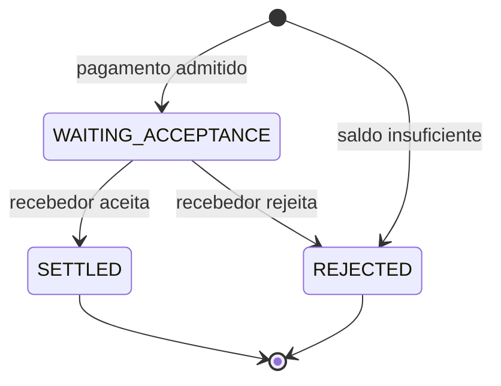

# System Design

O README descreve o fluxo do ponto de vista de quem faz um pagamento. Aqui o foco é o comportamento interno do sistema quando entram em cena duplicidade, concorrência e falhas.

As duas garantias principais são:

1. o estado do pagamento e a movimentação financeira precisam ser atualizados de forma consistente;
2. depois que uma confirmação é criada, ela precisa continuar recuperável durante a janela operacional de entrega.

O PostgreSQL é a autoridade sobre pagamentos e saldos. A outbox faz a ponte entre essa transação e o Kafka, evitando uma janela em que o pagamento seja concluído mas sua confirmação seja perdida. Depois da publicação, o Kafka mantém o histórico disponível durante a janela operacional de sete dias, e cada instituição controla o próprio progresso de consumo.

| Responsabilidade                          | Autoridade               |
| ----------------------------------------- | ------------------------ |
| Estado do pagamento e saldos              | PostgreSQL               |
| Obrigação de publicar uma confirmação     | PostgreSQL / outbox      |
| Confirmações disponíveis para recuperação | Kafka                    |
| Progresso já processado                   | Instituição participante |
| Acesso ao histórico                       | Notification Gateway     |

## 1. Fluxo de um pagamento

O pagamento possui poucos estados:



Uma instituição inicia um pagamento enviando uma `pacs.008`.

A identidade da instituição é obtida do certificado mTLS usado no ingresso. Apenas a instituição da conta pagadora pode iniciar o pagamento.

Se houver saldo suficiente, o pagamento entra em `WAITING_ACCEPTANCE`. O valor já é retirado do saldo disponível nesse momento, antes da decisão do recebedor.

O recebedor recebe a solicitação e responde com uma `pacs.002`. Apenas a instituição recebedora pode decidir o resultado do pagamento.

Se aceitar, o pagamento passa para `SETTLED` e o recebedor é creditado.

Se rejeitar, o pagamento passa para `REJECTED` e o valor reservado volta ao saldo disponível do pagador.

Quando não há saldo suficiente na entrada, o pagamento é rejeitado imediatamente e não chega a `WAITING_ACCEPTANCE`.

## 2. Corretude financeira

O efeito financeiro de cada transição é pequeno e explícito:

| Situação           | Efeito                                       |
| ------------------ | -------------------------------------------- |
| pagamento admitido | retira o valor da disponibilidade do pagador |
| recebedor aceita   | credita o recebedor                          |
| recebedor rejeita  | devolve o valor à disponibilidade do pagador |

Cada instituição possui uma única disponibilidade no PostgreSQL. `WAITING_ACCEPTANCE` significa que o valor já saiu da disponibilidade do pagador; por isso, o aceite credita somente o recebedor e a rejeição devolve a reserva.

Pagamentos que disputam a mesma disponibilidade são serializados pelo lock da row do participante. Dentro de um lote, pagamentos do mesmo pagador são avaliados em ordem determinística e seus deltas são agregados.

Uma repetição equivalente é um `no-op`; reutilizar a mesma identidade com outro conteúdo é conflito. Sob concorrência, somente pagamentos efetivamente criados podem reservar saldo, e somente transições efetivamente adquiridas a partir de `WAITING_ACCEPTANCE` podem creditar ou devolver dinheiro.

Cada efeito aplicado compartilha uma transação PostgreSQL com os demais registros do mesmo fato:

```text
estado do pagamento
+
movimentação financeira
+
auditoria
+
obrigação de enviar a confirmação
```

Ou tudo é persistido, ou nada é. A auditoria registra apenas fatos efetivamente aplicados; tentativas, conflitos e repetições sem efeito não criam um novo evento de negócio.

O contrato detalhado de identidade, reserva, concorrência, transições, auditoria e rollback está em [Corretude do pagamento](topics/payment-correctness.md).

## 3. Entrega recuperável das confirmações

A transação PostgreSQL cobre o estado financeiro e a criação da obrigação de notificar. A publicação no Kafka acontece depois dela e, portanto, precisa lidar com falhas nessa fronteira.

### Transactional outbox

A publicação no Kafka não participa da mesma transação que altera pagamentos e saldos.

Por isso, a confirmação a ser enviada é primeiro gravada em uma transactional outbox:

```text
transação PostgreSQL

├── pagamento
├── saldos
├── auditoria
└── notification_outbox
          │
          │ depois do commit
          ▼
        Kafka
```

A linha da outbox é criada junto com a alteração financeira.

Depois do commit, o SPI publica a confirmação no Kafka. A linha só é removida da outbox quando o broker confirma as mensagens correspondentes.

Se o processo cair antes da publicação, a confirmação continua registrada no PostgreSQL e pode ser retomada após a reinicialização.

Quando o resultado de uma publicação fica incerto, o lote pode ser enviado novamente. Isso pode produzir uma publicação duplicada, mas evita perder uma confirmação já criada.

### Kafka e entrega at-least-once

Depois que a publicação é confirmada, o Kafka mantém o histórico das confirmações disponíveis para entrega.

Não existe um segundo banco para acompanhar individualmente o estado de entrega de cada mensagem. As instituições acessam o histórico pelo Notification Gateway e usam um cursor para indicar até onde já processaram.

Esse cursor é autenticado e vinculado à instituição que o recebeu.

A instituição só avança o cursor depois de processar o lote de forma durável.

Se houver uma falha antes desse avanço, ela pode reutilizar o cursor anterior e receber parte das mensagens novamente.

A entrega é, portanto, **at-least-once**. O sistema não garante que uma confirmação será entregue fisicamente uma única vez.

Cada confirmação possui um identificador estável (`communicationId`), que permite reconhecer uma repetição sem reaplicar seu efeito lógico.

O tópico de notificações mantém sete dias de histórico.

O Gateway também mantém uma janela recente em memória para acelerar o caminho normal. Essa memória funciona apenas como otimização. Depois de uma reinicialização, ou quando o cursor aponta para uma posição mais antiga, o histórico volta a ser lido do Kafka.

### O que acontece quando há falhas

| Falha                                                   | Comportamento                                                                            |
| ------------------------------------------------------- | ---------------------------------------------------------------------------------------- |
| a transação PostgreSQL não conclui                      | pagamento, dinheiro, auditoria e obrigação de notificar não são persistidos parcialmente |
| o commit acontece, mas o processo cai antes de publicar | a confirmação continua registrada na outbox                                              |
| o resultado da publicação fica incerto                  | o lote pode ser publicado novamente                                                      |
| a instituição falha antes de avançar o cursor           | o cursor anterior pode ser reutilizado e as mensagens podem ser entregues novamente      |
| o Gateway reinicia                                      | o histórico necessário continua disponível no Kafka                                      |

Nos pontos em que não é possível tornar duas operações atomicamente únicas, o sistema aceita repetição e torna o processamento idempotente. Uma falha pode gerar uma nova tentativa, mas não um segundo efeito financeiro nem a perda silenciosa de uma confirmação dentro da janela operacional documentada.

## 4. Separação de responsabilidades

Cada componente mantém o tipo de estado para o qual foi escolhido:

```text
PostgreSQL

→ quem possui o dinheiro?
→ em que estado está o pagamento?
→ qual obrigação nasceu junto com essa mudança?

Kafka

→ quais confirmações ainda podem ser recuperadas?

Instituição participante

→ até onde eu já processei?

Notification Gateway

→ como eu acesso esse histórico?
```

O PostgreSQL mantém o estado financeiro porque pagamento, saldo, auditoria e criação da obrigação de notificar precisam participar da mesma transação.

Depois da publicação, o Kafka passa a manter o histórico durável usado para recuperação das confirmações.

Cada instituição é responsável por saber até onde processou esse histórico de forma durável.

O Notification Gateway fornece o protocolo de acesso ao histórico, mas não mantém a posição de processamento como estado autoritativo.

Com essa divisão, o PostgreSQL não precisa acompanhar entregas individuais, e o Kafka não participa da definição de saldo ou estado financeiro.

Também não há estado mantido apenas em memória que seja necessário para reconstruir a situação correta do sistema.

### Como chegamos a este desenho

O sistema não começou com essas fronteiras. Saldo, entrega de notificações, schema e geração de carga passaram por alternativas que foram medidas, simplificadas ou descartadas ao longo do projeto.

A [evolução da engenharia](engineering-evolution.md) explica quais problemas levaram às decisões atuais e aponta para os experimentos e documentos históricos que as sustentam.

## 5. Limites e trade-offs

O sistema qualificado atualmente possui alguns limites de ambiente e algumas escolhas explícitas de protocolo.

### Limites do ambiente

* o núcleo qualificado usa uma única instância de cada serviço;
* o Kafka local usa um único broker e fator de replicação 1;
* o protocolo de recuperação é exercitado, mas não a alta disponibilidade do broker;
* escala horizontal, operação multi-região e Kubernetes não fazem parte da qualificação atual.

### Trade-offs do protocolo

* as confirmações ficam disponíveis no fluxo operacional por sete dias; recuperações além dessa janela dependem dos mecanismos de recuperação de desastre;
* pagamentos em `WAITING_ACCEPTANCE` não possuem timeout automático; se o recebedor não responder, o valor pode permanecer reservado;
* saldo insuficiente rejeita o pagamento imediatamente; não existe fila de liquidez.

Dentro desses limites, as propriedades garantidas pelo sistema são **corretude financeira, idempotência, atomicidade e entrega recuperável durante a janela operacional**.
