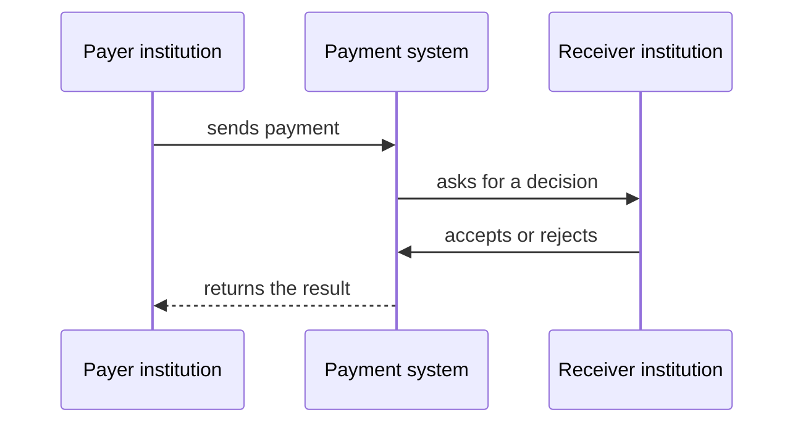
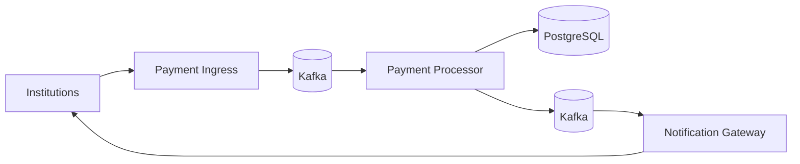

# How the system works

This document shows the system from the inside: who decides what happens to the money, how the result survives a failure, and why the work is split across different components.

The goal is to understand the design as a whole. Locks, SQL, message formats, and other implementation details are covered in the deeper documents.

## The payment journey

Two institutions take part in the flow: the payer's institution and the receiver's institution.

When the request arrives, the system checks whether the paying institution has enough available balance. If not, it rejects the payment immediately.

If the balance is enough, the amount is reserved before the receiver is asked. This prevents another payment from spending the same money while the system waits.

The receiver then decides:

* if it accepts, it receives the reserved amount;
* if it rejects, the amount becomes available to the paying institution again.

Finally, the result goes back to the institutions involved.

## Where each part fits

The **Payment Ingress** receives and authenticates messages. Its response only says that the request entered the system. It does not say yet whether the payment succeeded.

The **Payment Processor** is the authority for payments and money movement. This is where balance is reserved, credited, or returned.

**PostgreSQL** stores payments, balances, and audit history. It also lets the system commit together all changes produced by the same payment.

**Kafka** connects components that work at different speeds and keeps messages available while they move through the flow.

The **Notification Gateway** gives institutions a way to recover requests and results without moving that responsibility into the financial processor.

## What this design must preserve

### What if the same payment arrives again?

Messages can be repeated after a communication failure or a retry. The system recognizes that the payment already exists and keeps its result. The message may appear again; the money does not move again.

### What if two payments try to use the same balance?

PostgreSQL creates an order between payments that compete for the same institution's money. This wait exists only where there is a real conflict over the same balance. Independent institutions can continue separately.

### What if something fails in the middle?

Payment state, money movement, audit record, and the obligation to report the result are committed in the same transaction.

This means the system does not commit a payment without moving the related money, and it does not move the money without storing the obligation to report the result.

### What if the payment finishes but the confirmation does not arrive?

The obligation to send the confirmation is stored in PostgreSQL together with the payment. After that transaction commits, it is published to Kafka. This pattern is known as a **transactional outbox**.

Kafka keeps a recent history of confirmations. Institutions read this history through the Notification Gateway and use a cursor to report how far they have processed it.

If an institution fails before it finishes a batch, it can receive the same messages again. Delivery is **at-least-once**: duplicates are allowed; silent loss is not.

## Who owns each piece of information?

| Information | Authority |
| --- | --- |
| payments, balances, and audit | PostgreSQL |
| creation of the notification obligation | PostgreSQL / outbox |
| published and recoverable notifications | Kafka |
| processed progress | the institution itself |
| access to notification history | Notification Gateway |

This split prevents two different parts from trying to decide the same thing. Kafka does not decide the state of the money, the Gateway does not invent an institution's progress, and PostgreSQL does not need to track every individual delivery.

## Not every failure needs the same response

The system separates normal business results, invalid messages, and infrastructure failures.

Insufficient funds is a normal payment result. An invalid message is isolated so it does not block later messages. If infrastructure is temporarily unavailable, the work stays available for another attempt.

This avoids both endless retries and dropping work that could still finish successfully.

## Understanding the mechanisms

Each document below answers one specific question:

* [Payment correctness](topics/payment-correctness.md): how do identity, reservation, concurrency, and transactions protect the money?
* [Recoverable notification delivery](topics/notification-delivery.md): how do the outbox, Kafka, cursors, and Pull keep confirmations available?
* [Failure handling](topics/failure-handling.md): how are invalid inputs, outages, retries, and the DLQ classified?

## Scope of this version

A few decisions define how this version behaves:

* notifications stay available in Kafka for seven days;
* payments waiting for the receiver's decision do not expire automatically;
* insufficient funds causes an immediate rejection, with no liquidity queue;
* if a confirmation does not enter the publication path right after commit, it returns to the flow on the next startup.

[Engineering evolution](engineering-evolution.md) shows how the problems found during the project led to these decisions.
