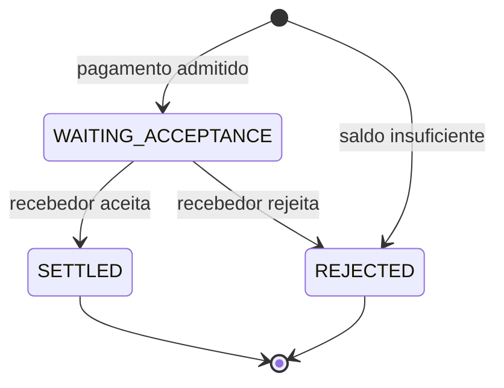

# System Design

O README apresenta o pagamento pelo ponto de vista do usuário. Internamente, o sistema precisa preservar duas garantias:

1. estado e movimentação financeira concluem juntos;
2. a confirmação permanece recuperável depois do commit.

PostgreSQL protege a primeira fronteira. A outbox, Kafka e o Notification Gateway protegem a segunda.

## 1. Fluxo do pagamento



O pagador inicia uma transferência com uma `pacs.008`. Sua identidade vem do certificado mTLS, e apenas a instituição da conta pagadora pode iniciar o pagamento.

Se houver saldo, o valor sai imediatamente da disponibilidade do pagador e o pagamento entra em `WAITING_ACCEPTANCE`. Comprometer o dinheiro antes da resposta impede que outro pagamento use a mesma disponibilidade.

O recebedor responde com uma `pacs.002`. Se aceitar, o pagamento passa para `SETTLED` e ele é creditado. Se rejeitar, o pagamento passa para `REJECTED` e a reserva volta ao pagador. Saldo insuficiente produz `REJECTED` já na admissão.

## 2. Corretude financeira

Cada transição possui um efeito financeiro explícito:

| Fato | Efeito |
| --- | --- |
| pagamento admitido | reduz a disponibilidade do pagador |
| recebedor aceita | credita o recebedor |
| recebedor rejeita | devolve a reserva ao pagador |

Cada instituição possui uma única row de saldo. Operações que disputam o mesmo dinheiro são serializadas pelo PostgreSQL; dentro de um lote, o SPI avalia os pagamentos em ordem, agrega seus deltas e aplica uma mutação por participante.

Uma identidade repetida com o mesmo conteúdo é um `no-op`. A mesma identidade com conteúdo diferente é conflito. Sob concorrência, somente pagamentos realmente criados reservam saldo, e somente transições efetivamente adquiridas a partir de `WAITING_ACCEPTANCE` movimentam dinheiro.

Estado, saldo, auditoria e obrigação de notificar compartilham a mesma transação:

```text
estado do pagamento
+ efeito financeiro
+ fato de auditoria
+ notification_outbox
```

Ou tudo é persistido, ou nada é. O contrato completo de identidade, reserva, concorrência, auditoria e rollback está em [Corretude do pagamento](topics/payment-correctness.md).

## 3. Entrega recuperável

PostgreSQL e Kafka não compartilham uma transação. A confirmação nasce, portanto, em uma transactional outbox criada junto com o fato financeiro:

```text
pagamento + saldo + auditoria + outbox
                    │
                    │ depois do commit
                    ▼
                  Kafka
                    ▼
          Notification Gateway
                    ▼ Pull(cursor)
                   PSP
```

O SPI remove a row da outbox somente depois que o broker confirma o lote. Uma publicação inconclusiva pode repetir mensagens; perder silenciosamente uma confirmação não é aceito. Rows remanescentes são recuperadas no startup.

Kafka mantém sete dias de histórico operacional. Cada instituição consulta o Gateway com um cursor autenticado e só deve avançá-lo depois de processar o lote duravelmente. Reapresentar um cursor antigo pode repetir mensagens, portanto a entrega é **at-least-once**.

O Gateway atende o caminho recente a partir de uma janela em memória e lê o Kafka diretamente quando o cursor não está coberto. Memória é aceleração, nunca autoridade.

Detalhes de publicação, particionamento, cursor, long polling e recuperação estão em [Entrega recuperável de notificações](topics/notification-delivery.md).

## 4. Falhas possuem destinos diferentes

| Classe | Reação |
| --- | --- |
| rejeição financeira | conclui o pagamento como resultado de negócio |
| entrada inválida ou sem autoridade | isola o record na DLQ |
| PostgreSQL temporariamente indisponível | preserva o batch e tenta novamente |
| defeito interno persistente | retry curto e depois batch para DLQ |
| fronteira de publicação inconclusiva | preserva ou repete a confirmação |

Essa separação evita tratar uma rejeição como pane, descartar trabalho durante indisponibilidade ou bloquear indefinidamente uma partição com uma mensagem determinística inválida. A política completa está em [Tratamento de falhas](topics/failure-handling.md).

## 5. Autoridades e limites

| Responsabilidade | Autoridade |
| --- | --- |
| pagamentos, saldos e auditoria | PostgreSQL |
| criação atômica da confirmação | PostgreSQL / outbox |
| histórico operacional publicado | Kafka |
| progresso já processado | instituição participante |
| acesso ao histórico | Notification Gateway |

Essa divisão impede que Kafka decida estado financeiro, que o Gateway invente progresso do participante ou que PostgreSQL acompanhe cada entrega individual.

O desenho qualificado assume alguns limites:

* uma instância de cada serviço e um broker Kafka com fator de replicação 1;
* nenhuma qualificação de escala horizontal, multi-região ou Kubernetes;
* retenção operacional de notificações por sete dias;
* nenhum timeout automático para pagamentos em `WAITING_ACCEPTANCE`;
* rejeição imediata por saldo insuficiente, sem fila de liquidez;
* uma row da outbox que perde o fast path pós-commit só é redescoberta no próximo startup.

A [evolução da engenharia](engineering-evolution.md) explica como experimentação, corretude e performance conduziram a essas fronteiras.
