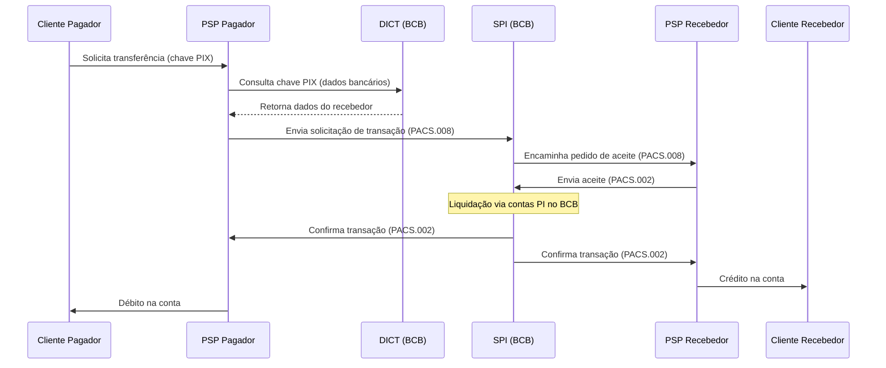

## Definição de escopo
O objetivo deste projeto é desenvolver uma versão simplificada de um **SPI (Sistema de Pagamentos Instantâneos)**, permitindo a integração de **PSPs (Payment Service Providers)**.

O sistema será composto por:
- **SPI**: responsável pelos endpoints de pagamento;
- **DICT (Diretório de Identificadores de Contas Transacionais)**: responsável por mapear as chaves PIX para os dados bancários.

Além disso, será implementada uma aplicação que atuará como uma **PSP**, expondo endpoints para a realização de transferências.

Cada módulo (SPI, DICT e PSP) passará por **testes de carga**, garantindo que a aplicação mantenha um bom desempenho sob alta demanda, de forma semelhante a um sistema real.

## SPI
A comunicação entre as **PSPs** e o **SPI** seguirá a **ISO 20022**.

### PSP → SPI
Os endpoints autenticam o PSP por mTLS. O **ISPB** é extraído do certificado
cliente e não é recebido como parâmetro de caminho.

> **ISPB** (Identificador de Sistema de Pagamentos Brasileiro): código único de 8 dígitos atribuído pelo Banco Central do Brasil a cada instituição financeira participante do **SPB** (Sistema de Pagamentos Brasileiro).

- **POST /transfer**
    - Recebimento de pedido de transação pela instituição do pagador.
    - Mensagem: **PACS.008**.

- **POST /transfer/status**
    - Recebimento da confirmação/aceite da transação pela instituição do recebedor.
    - Mensagem: **PACS.002**.

### SPI → PSP

**GET /{ispb}/messages**
Endpoint para recebimento de mensagens via _long polling_ clássico (sem uso de _chained URLs_).
Tipos de mensagens recebidas:
- **PACS.002** → Confirmação de transação.
- **PACS.008** → Solicitação de transação.
	- Nesse caso, a PSP do recebedor deverá processar o evento e enviar o aceite do pagamento (`POST /transfer/status`).


---
## DICT

O **DICT (Diretório de Identificadores de Contas Transacionais)** é responsável por mapear **chaves PIX** a dados bancários.

 **GET /keys/{chavePix}**
Consulta uma chave PIX no diretório.

**Exemplo de resposta:**

```json
{
  "Entry": {
    "Key": "11122233300",
    "KeyType": "CPF",
    "Account": {
      "Participant": "12345678", 
      "Branch": "0001",
      "AccountNumber": "0007654321",
      "AccountType": "CACC", 
      "OpeningDate": "2010-01-10T03:00:00Z"
    },
    "Owner": {
      "Type": "NATURAL_PERSON",
      "TaxIdNumber": "11122233300",
      "Name": "João Silva"
    },
    "CreationDate": "2019-11-18T03:00:00Z",
    "KeyOwnershipDate": "2019-11-18T03:00:00Z",
    "OpenClaimCreationDate": "2019-11-19T03:00:00Z"
  }
}
```

> **Nota**: o campo `Participant` representa o **ISPB** (8 dígitos) da instituição financeira. Devemos verificar onde obteríamos as informações adicionais como razão social.


**POST /keys**
Cria uma nova chave PIX para um cliente final.

**Exemplo de requisição:**

```json
{
	"Entry": {
	  "Key": "+5561988880000",
	  "KeyType": "PHONE",
	  "Account": {
		"Participant": "12345678",
		"Branch": "0001",
		"AccountNumber": "0007654321",
		"AccountType": "CACC",
		"OpeningDate": "2010-01-10T03:00:00Z"
	  },
	  "Owner": {
		"Type": "NATURAL_PERSON",
		"TaxIdNumber": "11122233300",
		"Name": "João Silva"
	  }
	},
	"Reason": "USER_REQUESTED",
	"RequestId": "a946d533-7f22-42a5-9a9b-e87cd55c0f4d"
}
```

---

## PSP
Esses endpoints seriam usados por uma interface da própria instituição de pagamentos, para que o cliente final pudesse realizar transações de forma intuitiva.


**POST /{userId}/transfer**
Cria uma nova transferência em nome do cliente.

**Request Body (exemplo)**

```json
{
  "amount": 150.75,
  "currency": "BRL",
  "description": "Almoço com amigos",
  "pixKey": "joao.silva@email.com",
  "pixKeyType": "EMAIL",
  "requestId": "c2a7b7f0-0f12-4f9e-b8c7-1d3a2e1e65bb"
}
```

- **amount** → valor da transferência.
- **currency** → moeda da transação (fixo `BRL` neste caso).
- **description** → descrição opcional da transferência.
- **pixKey** → chave PIX do recebedor.
- **pixKeyType** → tipo da chave (`CPF`, `CNPJ`, `EMAIL`, `PHONE`, `EVP`).
- **requestId** → identificador único do pedido (idempotência).

**Response Body (exemplo)**

```json
{
  "transferId": "8f2e92b6-9f32-4bb7-8b5a-9cfdc8b2e1a3",
  "status": "PENDING",
  "createdAt": "2025-08-26T14:32:00Z",
  "amount": 150.75,
  "currency": "BRL",
  "description": "Almoço com amigos",
  "recipient": {
    "pixKey": "joao.silva@email.com",
    "pixKeyType": "EMAIL"
  }
}
```

- **transferId** → identificador único da transferência dentro da PSP.
- **status** → status inicial da transferência (`PENDING`, `COMPLETED`, `FAILED`).
- **createdAt** → data/hora de criação.
- **recipient** → dados básicos do recebedor (chave PIX usada).

---
## Fluxo do processamento da transação



### Requisitos de Performance do fluxo

#### SPI
| Métrica           | Valor Alvo | Observação                                                                    |
| ----------------- | ---------- | ----------------------------------------------------------------------------- |
| Capacidade mínima | 2000 ops/s | Operação = solicitação de transferência (PACS.008) até confirmação (PACS.002) |
| Latência p99      | ≤ 4.6s     | Tempo máximo entre solicitação e confirmação às PSPs                          |

#### PSP
| Métrica                                      | Valor Alvo | Observação                                                       |
| -------------------------------------------- | ---------- | ---------------------------------------------------------------- |
| Tempo de resposta ao aceite (PSP recebedora) | ≤ 2.4s     | Tempo máximo para aceitar/rejeitar solicitação enviada pelo SPI  |
| Tempo para enviar solicitação (PSP pagadora) | ≤ 1.5s     | Tempo máximo a partir da solicitação do cliente até envio ao SPI |

---
## Tech Stack

| Tecnologia               | Função no projeto                                                                                                                                                                        |
| ------------------------ | ---------------------------------------------------------------------------------------------------------------------------------------------------------------------------------------- |
| **Java + Spring Boot**   | Linguagem e framework principal para implementar os serviços (SPI, DICT e PSP). Facilita a criação de APIs REST, integração com bancos de dados e segurança.                             |
| **Kafka**                | Plataforma de mensageria distribuída para comunicação assíncrona e desacoplada entre os serviços. Útil para eventos internos, logs de auditoria e simulação de alto volume de mensagens. |
| **K6**                   | Ferramenta de testes de carga. Usada para validar requisitos de performance (ex.: SPI processando 2000 operações/segundo, p99 ≤ 4.6s).                                                   |
| **Kubernetes**           | Orquestração de contêineres. Garante escalabilidade, alta disponibilidade e gerenciamento automático dos serviços em ambiente distribuído.                                               |
| **PostgreSQL**           | Banco de dados principal. Adequado para manter consistência em registros críticos como chaves PIX (DICT) e transações.                                                                   |
| **Prometheus + Grafana** | Coleta e visualização de métricas (ex.: latência, throughput, erros). Útil para acompanhar se os SLAs de SPI e PSP estão sendo cumpridos.                                                |
