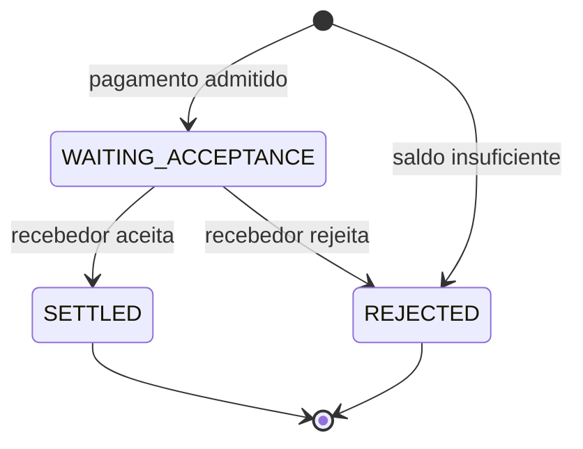

# Corretude do pagamento

Este documento responde a uma pergunta: **quais invariantes tornam um pagamento correto?**

Seu escopo começa quando o SPI recebe uma instrução autenticada e termina quando a transação financeira cria uma obrigação durável de informar o resultado. A política operacional de retry e DLQ e a entrega posterior dessas notificações possuem autoridades próprias; aqui elas aparecem somente onde afetam a transação do pagamento.

## O contrato

Um pagamento correto preserva simultaneamente estas propriedades:

1. uma mesma identidade lógica não movimenta dinheiro duas vezes;
2. dinheiro comprometido por um pagamento pendente deixa de estar disponível para outros pagamentos;
3. somente a instituição pagadora pode iniciar o pagamento e somente a recebedora pode decidir seu resultado;
4. estado, saldo, auditoria e obrigação de notificar representam o mesmo fato de negócio;
5. concorrência pode definir uma ordem entre operações, mas não pode criar saldo, duplicar efeitos ou produzir dois resultados terminais.

Essas propriedades são protegidas pela combinação entre regras de domínio e transações PostgreSQL. Kafka pode repetir mensagens e o protocolo de entrega pode repetir notificações; o efeito financeiro correspondente não pode se repetir.

## Estados e efeitos financeiros

O pagamento possui três estados persistidos:



Cada participante possui uma única disponibilidade em `participant_balance_entity`. Valores monetários são armazenados como centavos inteiros.

Não existe saldo reservado, tabela de reservas ou bucket de liquidez. A reserva é representada pelo próprio pagamento:

```text
payment.state = WAITING_ACCEPTANCE
        +
payment.amount_cents já saiu da disponibilidade do pagador
```

Por isso, cada transição possui exatamente um efeito financeiro:

| Fato | Estado resultante | Efeito |
| --- | --- | --- |
| pagamento admitido | `WAITING_ACCEPTANCE` | reduz a disponibilidade do pagador |
| insuficiência de saldo na admissão | `REJECTED` | não altera saldos |
| recebedor aceita | `SETTLED` | credita o recebedor |
| recebedor rejeita | `REJECTED` | devolve a reserva ao pagador |

O pagador não é debitado novamente no aceite. O débito já aconteceu quando o pagamento entrou em `WAITING_ACCEPTANCE`.

## Admissão de uma nova instrução

Uma instrução de pagamento chega com a identidade da instituição autenticada no ingresso. O ISPB autenticado precisa ser o mesmo da conta pagadora descrita na instrução; outra instituição não pode iniciar aquele pagamento.

Depois da validação, o processamento distingue quatro resultados:

| Entrada | Resultado |
| --- | --- |
| identidade nova e saldo disponível | cria o pagamento, reserva o valor e solicita decisão ao recebedor |
| identidade nova e saldo insuficiente | cria uma rejeição terminal por `INSUFFICIENT_FUNDS` |
| mesma identidade e mesmo conteúdo | não produz novo efeito |
| mesma identidade e conteúdo diferente | classifica conflito determinístico |

Somente as rows que a transação corrente conseguiu estabelecer como pagamentos novos entram no cálculo de reserva, na auditoria e na criação das notificações. Essa é a fronteira que impede duas cópias concorrentes da mesma instrução de reservarem duas vezes.

### Identidade e fingerprint

`paymentId` / `EndToEndId` é a identidade lógica do pagamento. O conteúdo é representado por um fingerprint versionado:

```text
request_fingerprint_version
+
SHA-256 da representação canônica da instrução
```

A representação inclui valor, moeda, descrição e dados das partes e contas. Campos textuais são normalizados antes do hash. Versão e hash são comparados juntos; um hash sem uma versão compatível não basta para declarar duas instruções equivalentes.

Uma repetição equivalente é um `no-op`: não altera saldo, não cria outro fato de auditoria e não reconstrói uma obrigação de notificação. A entrega originalmente criada continua sendo a autoridade, mesmo que sua row já tenha saído da outbox depois da publicação.

Quando duas instruções com o mesmo `paymentId` e conteúdos diferentes aparecem no mesmo lote sem estado anterior que determine a identidade válida, todas são tratadas como conflitantes. Quando o pagamento já existe, o fingerprint persistido decide qual entrada é uma repetição e qual é divergente.

### Reserva e saldo insuficiente

Os pagamentos novos são agrupados pelo ISPB pagador. A transação bloqueia uma vez a row de saldo de cada pagador envolvido, sempre em ordem determinística entre participantes.

Dentro do grupo de um pagador, os pagamentos são avaliados pela ordem de origem do lote. Uma rejeição não interrompe os pagamentos seguintes:

```text
saldo disponível = 100

80 → reserva; restam 20
50 → rejeita; restam 20
10 → reserva; restam 10
```

Os débitos aprovados são agregados e aplicados em uma mutação física por participante. A restrição do banco impede saldo negativo, e a transação falha se alguma row de saldo necessária estiver ausente ou se o débito agregado não puder ser aplicado integralmente.

Um pagamento sem saldo suficiente termina como `REJECTED / INSUFFICIENT_FUNDS` na própria transação de admissão. Ele não cria reserva nem solicitação de aceite ao recebedor; cria a auditoria e a obrigação de informar a rejeição ao pagador.

## Decisão do recebedor

O recebedor responde com uma decisão autenticada. O ISPB autenticado precisa ser o mesmo da instituição recebedora persistida no pagamento.

Antes de decidir, a transação bloqueia as rows dos pagamentos em ordem determinística. Os resultados possíveis são:

| Decisão recebida | Estado atual | Resultado |
| --- | --- | --- |
| aceita | `WAITING_ACCEPTANCE` | transiciona para `SETTLED` e credita o recebedor |
| rejeita com motivo | `WAITING_ACCEPTANCE` | transiciona para `REJECTED` e devolve o valor ao pagador |
| mesma decisão e mesmos motivos | estado terminal correspondente | `no-op` |
| decisão incompatível | estado terminal diferente | conflito |
| qualquer decisão | pagamento inexistente | conflito |
| qualquer decisão | rejeição interna por saldo insuficiente | conflito |

Decisões de rejeição externas preservam seus códigos de motivo. A rejeição interna por insuficiência usa `rejection_cause = INSUFFICIENT_FUNDS`; as duas origens são mutuamente exclusivas no schema.

Respostas equivalentes dentro do mesmo lote são reduzidas a uma única decisão lógica. Se o mesmo pagamento recebe decisões ou motivos incompatíveis entre as respostas autorizadas do lote, elas não produzem transição.

### Adquirir a transição antes de movimentar o dinheiro

Uma decisão candidata ainda não autoriza sozinha uma alteração de saldo. Primeiro, a transação precisa adquirir a mudança condicional:

```text
WAITING_ACCEPTANCE → SETTLED
```

ou:

```text
WAITING_ACCEPTANCE → REJECTED
```

Somente as rows cuja transição foi efetivamente adquirida pela transação corrente contribuem para os deltas financeiros, para a auditoria e para as notificações. Duas respostas concorrentes podem observar a mesma identidade lógica, mas apenas uma consegue realizar a transição a partir de `WAITING_ACCEPTANCE`.

Depois disso, os deltas são agregados por participante: aceites creditam recebedores; rejeições devolvem reservas aos pagadores. As rows de saldo necessárias também são bloqueadas em ordem determinística antes da aplicação.

Essa regra impede tanto o crédito duplicado quanto a devolução duplicada.

## Uma única fronteira transacional

Cada mudança efetiva reúne quatro dimensões:

```text
estado do pagamento
+
efeito financeiro
+
fato de auditoria
+
obrigação de notificar
```

Elas usam comandos bulk separados, mas participam da mesma transação PostgreSQL coordenada pelo serviço de aplicação.

Na admissão com saldo:

```text
cria WAITING_ACCEPTANCE
+
debita disponibilidade do pagador
+
registra PAYMENT_RESERVED
+
cria solicitação de aceite para o recebedor
```

No aceite:

```text
WAITING_ACCEPTANCE → SETTLED
+
credita recebedor
+
registra PAYMENT_SETTLED
+
cria confirmações para pagador e recebedor
```

Na rejeição do recebedor:

```text
WAITING_ACCEPTANCE → REJECTED
+
devolve reserva ao pagador
+
registra PAYMENT_REJECTED
+
cria confirmação para o pagador
```

Se a persistência de auditoria ou da outbox falhar, a mudança de estado e os saldos também são revertidos. Não existe commit parcial no qual o estado afirma uma coisa, o dinheiro registra outra ou uma transição concluída perde a obrigação de informar seu resultado.

## Auditoria orientada a fatos

A auditoria registra efeitos de negócio aplicados, não tentativas de processamento:

| Evento | O que prova |
| --- | --- |
| `PAYMENT_RESERVED` | o pagamento foi criado e o valor saiu da disponibilidade do pagador |
| `PAYMENT_SETTLED` | o pagamento foi aceito e o recebedor foi creditado |
| `PAYMENT_REJECTED` na admissão | o pagamento foi rejeitado sem reserva por insuficiência de saldo |
| `PAYMENT_REJECTED` após reserva | o recebedor rejeitou e a disponibilidade do pagador foi restaurada |

Uma repetição idempotente, uma entrada não autorizada ou um conflito não representa um novo fato financeiro e não cria evento de negócio.

O schema permite no máximo um fato de admissão e um fato terminal por pagamento. Constraints também relacionam tipo do evento, estados, origem da rejeição e deltas financeiros, impedindo combinações que contradigam o modelo.

`event_id` é apenas uma identidade técnica. Ele não define uma ordem causal entre eventos de pagamentos diferentes.

## Onde a garantia vive

As invariantes não dependem de um único mecanismo:

| Propriedade | Mecanismo principal |
| --- | --- |
| identidade lógica única | chave primária de `payment_transaction_entity` |
| equivalência de uma repetição | fingerprint canônico e versionado |
| saldo nunca negativo | lock da row de participante e constraint PostgreSQL |
| apenas o dono inicia | comparação entre ISPB autenticado e pagador |
| apenas o recebedor decide | comparação entre ISPB autenticado e recebedor persistido |
| uma única transição terminal | lock da row e update condicional a partir de `WAITING_ACCEPTANCE` |
| auditoria consistente | mesma transação e constraints sobre os fatos |
| notificação não esquecida no commit financeiro | outbox criada na mesma transação |

## Limites assumidos

Este modelo aceita alguns limites deliberados:

* uma row de saldo por participante cria serialização intencional quando operações disputam a mesma disponibilidade;
* um pagamento em `WAITING_ACCEPTANCE` não expira automaticamente e pode manter dinheiro reservado se o recebedor nunca responder;
* saldo insuficiente produz rejeição imediata; não há fila de liquidez;
* ausência da row de saldo esperada é falha operacional, não criação automática de dinheiro;
* a qualificação atual não cobre múltiplas instâncias do SPI nem contenção entre réplicas;
* a auditoria não registra tentativas, replays sem efeito ou o payload PACS original.

Esses limites não mudam as invariantes dentro do escopo qualificado; delimitam as condições em que elas foram demonstradas.

## Verificação no repositório

As regras de domínio estão concentradas em:

* [`PaymentAdmissionPolicy`](../../spi/src/main/java/br/kauan/spi/domain/services/payment/PaymentAdmissionPolicy.java);
* [`LiquidityReservationPolicy`](../../spi/src/main/java/br/kauan/spi/domain/services/payment/LiquidityReservationPolicy.java);
* [`StatusTransitionPolicy`](../../spi/src/main/java/br/kauan/spi/domain/services/payment/StatusTransitionPolicy.java);
* [`RequestFingerprint`](../../spi/src/main/java/br/kauan/spi/domain/services/payment/RequestFingerprint.java).

O schema e as garantias transacionais podem ser verificados em:

* [`V1__Create_spi_baseline.sql`](../../spi/src/main/resources/db/migration/V1__Create_spi_baseline.sql);
* [`ConcurrentParticipantBalanceIntegrationTest`](../../spi/src/test/java/br/kauan/spi/domain/services/ConcurrentParticipantBalanceIntegrationTest.java);
* [`TransactionalOutboxIntegrationTest`](../../spi/src/test/java/br/kauan/spi/domain/services/TransactionalOutboxIntegrationTest.java);
* [`TransactionalOutboxRollbackIntegrationTest`](../../spi/src/test/java/br/kauan/spi/domain/services/TransactionalOutboxRollbackIntegrationTest.java).
