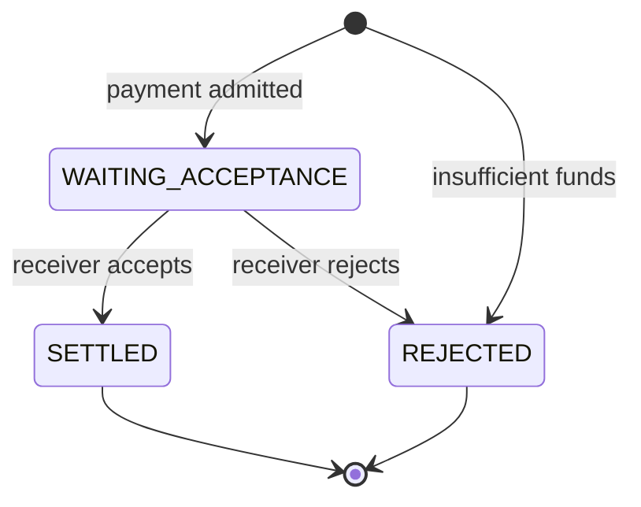

# How payment correctness is preserved

This document answers one question:

> What prevents a repeated message, competition for the same balance, or a failure in the middle of the flow from producing an incorrect financial result?

We follow the flow from an authenticated request reaching the Payment Processor to the durable creation of its confirmation. Retries, invalid-message isolation, and later delivery appear only where they affect this transaction.

## What must never break

The system must preserve five rules at the same time:

1. the same logical identity never moves money twice;
2. money committed to a pending payment is no longer available to other payments;
3. only the paying institution can start the payment, and only the receiving institution can decide its result;
4. state, balance, audit, and the obligation to notify represent the same business fact;
5. concurrency may create an order between operations, but it cannot create balance, duplicate effects, or produce two terminal results.

Business rules and PostgreSQL transactions work together to protect these properties. Kafka may repeat messages, and delivery may repeat confirmations. The related financial effect must not repeat.

## State shows where the money is

A payment has three persisted states:



Each institution has one available-balance record stored in `participant_balance_entity`. Values are stored as integer cents.

There is no second table that contains “reserved money.” The payment itself represents the reservation:

```text
payment.state = WAITING_ACCEPTANCE
        +
payment.amount_cents has already left payer availability
```

Each transition has exactly one financial effect:

| Fact | Resulting state | Effect |
| --- | --- | --- |
| payment admitted | `WAITING_ACCEPTANCE` | reduces payer availability |
| insufficient funds at admission | `REJECTED` | does not change balances |
| receiver accepts | `SETTLED` | credits the receiver |
| receiver rejects | `REJECTED` | returns the reservation to the payer |

The payer is not debited again when the receiver accepts. The debit already happened when the payment entered `WAITING_ACCEPTANCE`.

## When a new request arrives

The request arrives with the identity of the institution authenticated at ingress, represented by its ISPB. This identity must match the paying account's institution. Another institution cannot start the payment on its behalf.

After validation, processing separates four results:

| Input | Result |
| --- | --- |
| new identity and enough balance | create the payment, reserve the amount, and ask the receiver for a decision |
| new identity and insufficient balance | create a terminal `INSUFFICIENT_FUNDS` rejection |
| same identity and same content | produce no new effect |
| same identity and different content | classify as a deterministic conflict |

Reservation calculation, audit, and notifications use only payments created by this transaction. So two concurrent copies of the same request cannot reserve the amount twice.

### How the system recognizes a duplicate

`paymentId` / `EndToEndId` identifies the payment. To check whether a new message really has the same content, the system creates a signature called a **fingerprint**:

```text
request_fingerprint_version
+
SHA-256 of the canonical instruction representation
```

The signature includes amount, currency, description, and party and account data. Text is normalized before hashing. The version is also part of the comparison. This prevents a future normalization rule from accidentally making different content equivalent.

An equivalent duplicate does nothing again: it does not change balance, create another audit fact, or rebuild the notification obligation. The confirmation created during the first processing remains the valid one even after it leaves the outbox.

When two instructions with the same `paymentId` but different content appear in the same batch, there may be no earlier state that says which content is valid. In that case, all of them are treated as conflicting. When the payment already exists, the persisted fingerprint decides which input is a duplicate and which is different.

### How reservation is decided

New payments are grouped by paying institution. The transaction locks each payer's balance record once, always in the same order across participants.

Inside one payer group, payments are evaluated in their source order from the batch. One rejection does not stop later payments:

```text
available balance = 100

80 → reserve; 20 left
50 → reject; 20 left
10 → reserve; 10 left
```

Approved debits are added together and applied in one change per participant. The database itself prevents a negative balance. If a required record is missing or the full debit cannot be applied, the whole transaction fails.

A payment without enough balance ends as `REJECTED / INSUFFICIENT_FUNDS` inside the admission transaction. It creates no reservation and no request for receiver acceptance. The same transaction creates the audit fact and the obligation to tell the payer about the rejection.

## When the receiver responds

The receiver also responds with its authenticated identity. It must match the receiving institution stored in the payment.

Before deciding, the transaction locks payment records in a stable order. The possible results are:

| Received decision | Current state | Result |
| --- | --- | --- |
| accept | `WAITING_ACCEPTANCE` | move to `SETTLED` and credit the receiver |
| reject with reason | `WAITING_ACCEPTANCE` | move to `REJECTED` and return the amount to the payer |
| same decision and same reasons | matching terminal state | preserve the existing result |
| incompatible decision | different terminal state | conflict |
| any decision | payment does not exist | conflict |
| any decision | internal rejection for insufficient funds | conflict |

A rejection sent by the receiver keeps its reason codes. Insufficient funds, on the other hand, uses the internal cause `INSUFFICIENT_FUNDS`. The schema prevents both sources from appearing together.

Equivalent responses inside the same batch are reduced to one logical decision. If the same payment receives incompatible decisions or reasons across authorized responses in the batch, they do not produce a transition.

### Change state first, then calculate money

Receiving a decision is not enough to change a balance. First, the transaction must successfully change the payment while it is still waiting for a response:

```text
WAITING_ACCEPTANCE → SETTLED
```

or:

```text
WAITING_ACCEPTANCE → REJECTED
```

Financial calculations, audit, and notifications use only payments that this transaction moved to a final state. Two concurrent responses can find the same payment, but only one can move it out of `WAITING_ACCEPTANCE`.

After that, effects are added per participant. Accepts credit receivers; rejections return reservations to payers. Required balance records are also locked in a stable order.

This rule prevents both duplicate credit and duplicate return.

## Everything finishes in the same transaction

Every effective change has four parts:

```text
payment state
+
financial effect
+
audit fact
+
obligation to notify
```

The code may persist each part with a different command, but all of them take part in the same PostgreSQL transaction.

For admission with enough balance:

```text
create WAITING_ACCEPTANCE
+
debit payer availability
+
record PAYMENT_RESERVED
+
create acceptance request for receiver
```

For acceptance:

```text
WAITING_ACCEPTANCE → SETTLED
+
credit receiver
+
record PAYMENT_SETTLED
+
create confirmations for payer and receiver
```

For receiver rejection:

```text
WAITING_ACCEPTANCE → REJECTED
+
return reservation to payer
+
record PAYMENT_REJECTED
+
create confirmation for payer
```

If audit or outbox persistence fails, the state change and balances are rolled back as well. There is no partial commit: state, money, audit, and notification obligation move together or roll back together.

## Audit records what actually happened

Audit records applied business effects, not processing attempts:

| Event | What it proves |
| --- | --- |
| `PAYMENT_RESERVED` | the payment was created and the amount left payer availability |
| `PAYMENT_SETTLED` | the payment was accepted and the receiver was credited |
| `PAYMENT_REJECTED` at admission | the payment was rejected without reservation because of insufficient funds |
| `PAYMENT_REJECTED` after reservation | the receiver rejected and payer availability was restored |

A duplicate with no effect, an unauthorized input, or a conflict does not represent a new financial fact, so it does not create a new business event.

The database allows at most one admission fact and one terminal fact per payment. Other constraints connect event type to states, rejection source, and financial effects. This prevents combinations that contradict the model.

`event_id` is only a technical identity. It does not define causal order between events from different payments.

## How each rule is protected

The invariants do not depend on one mechanism alone:

| Property | Main mechanism |
| --- | --- |
| one logical identity | primary key of `payment_transaction_entity` |
| equivalent duplicate detection | canonical, versioned fingerprint |
| balance never below zero | balance-record lock and PostgreSQL constraint |
| only the owner can start | compare authenticated ISPB with payer |
| only the receiver can decide | compare authenticated ISPB with persisted receiver |
| one terminal transition | payment lock and conditional change from `WAITING_ACCEPTANCE` |
| consistent audit | same transaction and constraints on audit facts |
| notification not forgotten during financial commit | outbox created in the same transaction |

## Model scope

In this project:

* each participant has one balance record, so operations on the same available balance may wait for each other;
* a payment in `WAITING_ACCEPTANCE` does not expire automatically and may keep money reserved if the receiver never responds;
* insufficient funds causes immediate rejection, with no liquidity queue;
* a missing expected balance record is treated as an operational failure, not as automatic creation of money;
* concurrency tests use one Payment Processor instance and do not test contention across replicas;
* audit records business effects, not attempts, no-op duplicates, or the original PACS message.

## Check it in the code

Domain rules are concentrated in:

* [`PaymentAdmissionPolicy`](../../spi/src/main/java/br/kauan/spi/domain/services/payment/PaymentAdmissionPolicy.java);
* [`LiquidityReservationPolicy`](../../spi/src/main/java/br/kauan/spi/domain/services/payment/LiquidityReservationPolicy.java);
* [`StatusTransitionPolicy`](../../spi/src/main/java/br/kauan/spi/domain/services/payment/StatusTransitionPolicy.java);
* [`RequestFingerprint`](../../spi/src/main/java/br/kauan/spi/domain/services/payment/RequestFingerprint.java).

The schema and transactional guarantees can be checked in:

* [`V1__Create_spi_baseline.sql`](../../spi/src/main/resources/db/migration/V1__Create_spi_baseline.sql);
* [`ConcurrentParticipantBalanceIntegrationTest`](../../spi/src/test/java/br/kauan/spi/domain/services/ConcurrentParticipantBalanceIntegrationTest.java);
* [`TransactionalOutboxIntegrationTest`](../../spi/src/test/java/br/kauan/spi/domain/services/TransactionalOutboxIntegrationTest.java);
* [`TransactionalOutboxRollbackIntegrationTest`](../../spi/src/test/java/br/kauan/spi/domain/services/TransactionalOutboxRollbackIntegrationTest.java).
