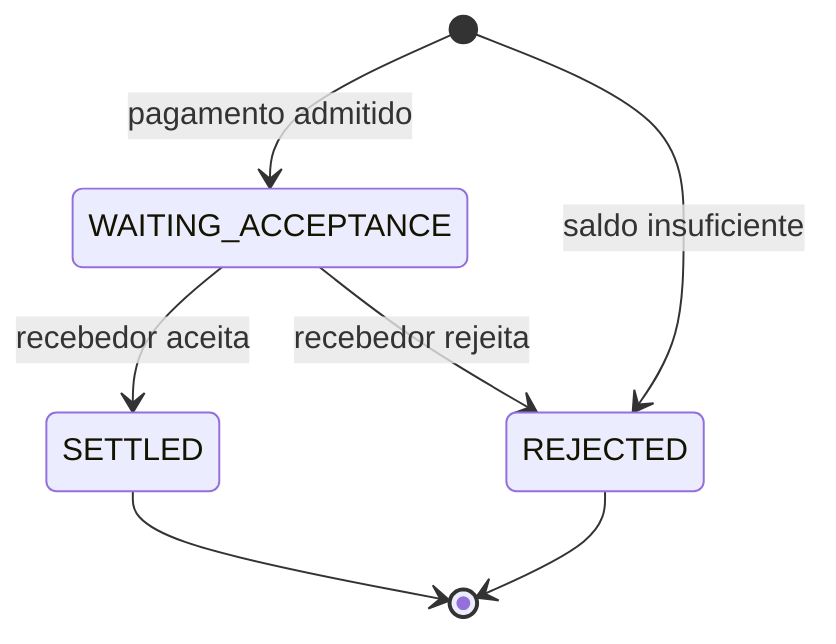

# Como o pagamento permanece correto

Este documento responde a uma pergunta:

> O que impede uma mensagem repetida, uma disputa pelo mesmo saldo ou uma falha no meio do caminho de produzir um resultado financeiro incorreto?

Aqui acompanhamos o fluxo desde a chegada de um pedido autenticado ao Payment Processor até a criação durável de sua confirmação. Novas tentativas, isolamento de mensagens inválidas e entrega posterior aparecem somente quando afetam essa transação.

## O que nunca pode ser quebrado

O sistema precisa preservar cinco regras ao mesmo tempo:

1. uma mesma identidade lógica não movimenta dinheiro duas vezes;
2. dinheiro comprometido por um pagamento pendente deixa de estar disponível para outros pagamentos;
3. somente a instituição pagadora pode iniciar o pagamento e somente a recebedora pode decidir seu resultado;
4. estado, saldo, auditoria e obrigação de notificar representam o mesmo fato de negócio;
5. concorrência pode definir uma ordem entre operações, mas não pode criar saldo, duplicar efeitos ou produzir dois resultados terminais.

Regras de negócio e transações PostgreSQL trabalham juntas para proteger essas propriedades. Kafka pode repetir mensagens, e a entrega pode repetir confirmações. O efeito financeiro correspondente não pode se repetir.

## O estado mostra onde o dinheiro está

O pagamento possui três estados persistidos:



Cada instituição possui um único registro de saldo disponível, armazenado em `participant_balance_entity`. Os valores são guardados como centavos inteiros.

Não existe uma segunda tabela contendo “dinheiro reservado”. A reserva é representada pelo próprio pagamento:

```text
payment.state = WAITING_ACCEPTANCE
        +
payment.amount_cents já saiu da disponibilidade do pagador
```

Por isso, cada transição possui exatamente um efeito financeiro:

| Fato | Estado resultante | Efeito |
| --- | --- | --- |
| pagamento admitido | `WAITING_ACCEPTANCE` | reduz a disponibilidade do pagador |
| insuficiência de saldo na admissão | `REJECTED` | não altera saldos |
| recebedor aceita | `SETTLED` | credita o recebedor |
| recebedor rejeita | `REJECTED` | devolve a reserva ao pagador |

O pagador não é debitado novamente no aceite. O débito já aconteceu quando o pagamento entrou em `WAITING_ACCEPTANCE`.

## Quando um pedido novo chega

O pedido chega acompanhado da identidade da instituição autenticada na entrada, representada por seu ISPB. Essa identidade precisa ser a mesma da conta pagadora; outra instituição não pode iniciar o pagamento em seu nome.

Depois da validação, o processamento distingue quatro resultados:

| Entrada | Resultado |
| --- | --- |
| identidade nova e saldo disponível | cria o pagamento, reserva o valor e solicita decisão ao recebedor |
| identidade nova e saldo insuficiente | cria uma rejeição terminal por `INSUFFICIENT_FUNDS` |
| mesma identidade e mesmo conteúdo | não produz novo efeito |
| mesma identidade e conteúdo diferente | classifica conflito determinístico |

Somente os pagamentos que esta transação realmente conseguiu criar entram no cálculo da reserva, na auditoria e nas notificações. Assim, duas cópias concorrentes do mesmo pedido não conseguem reservar o valor duas vezes.

### Como o sistema reconhece uma repetição

`paymentId` / `EndToEndId` identifica o pagamento. Para saber se uma nova mensagem realmente possui o mesmo conteúdo, o sistema cria uma assinatura chamada **fingerprint**:

```text
request_fingerprint_version
+
SHA-256 da representação canônica da instrução
```

Essa assinatura inclui valor, moeda, descrição e dados das partes e contas. Textos são normalizados antes do hash. A versão também é comparada, pois uma futura regra de normalização não pode tornar conteúdos diferentes equivalentes por acidente.

Uma repetição equivalente não faz nada novamente: não altera saldo, não cria outro fato de auditoria e não reconstrói a obrigação de notificar. A confirmação criada no primeiro processamento continua sendo a válida, mesmo depois de sair da outbox.

Quando duas instruções com o mesmo `paymentId` e conteúdos diferentes aparecem no mesmo lote sem estado anterior que determine a identidade válida, todas são tratadas como conflitantes. Quando o pagamento já existe, o fingerprint persistido decide qual entrada é uma repetição e qual é divergente.

### Como a reserva é decidida

Os pagamentos novos são agrupados pela instituição pagadora. A transação bloqueia uma vez o registro de saldo de cada pagador envolvido, sempre na mesma ordem entre participantes.

Dentro do grupo de um pagador, os pagamentos são avaliados pela ordem de origem do lote. Uma rejeição não interrompe os pagamentos seguintes:

```text
saldo disponível = 100

80 → reserva; restam 20
50 → rejeita; restam 20
10 → reserva; restam 10
```

Os débitos aprovados são somados e aplicados em uma única alteração por participante. O próprio banco impede saldo negativo. Se algum registro necessário estiver ausente ou o débito completo não puder ser aplicado, a transação inteira falha.

Um pagamento sem saldo suficiente termina como `REJECTED / INSUFFICIENT_FUNDS` na própria transação de admissão. Ele não cria reserva nem solicitação de aceite ao recebedor; cria a auditoria e a obrigação de informar a rejeição ao pagador.

## Quando o recebedor responde

O recebedor também responde com sua identidade autenticada. Ela precisa ser a mesma instituição recebedora registrada no pagamento.

Antes de decidir, a transação bloqueia os registros dos pagamentos sempre na mesma ordem. Os resultados possíveis são:

| Decisão recebida | Estado atual | Resultado |
| --- | --- | --- |
| aceita | `WAITING_ACCEPTANCE` | transiciona para `SETTLED` e credita o recebedor |
| rejeita com motivo | `WAITING_ACCEPTANCE` | transiciona para `REJECTED` e devolve o valor ao pagador |
| mesma decisão e mesmos motivos | estado terminal correspondente | preserva o resultado existente |
| decisão incompatível | estado terminal diferente | conflito |
| qualquer decisão | pagamento inexistente | conflito |
| qualquer decisão | rejeição interna por saldo insuficiente | conflito |

Uma rejeição enviada pelo recebedor preserva seus códigos de motivo. Saldo insuficiente, por outro lado, usa a causa interna `INSUFFICIENT_FUNDS`. O schema impede que as duas origens apareçam juntas.

Respostas equivalentes dentro do mesmo lote são reduzidas a uma única decisão lógica. Se o mesmo pagamento recebe decisões ou motivos incompatíveis entre as respostas autorizadas do lote, elas não produzem transição.

### Primeiro mudar o estado, depois calcular o dinheiro

Receber uma decisão não basta para alterar o saldo. Primeiro, a transação precisa conseguir mudar o pagamento enquanto ele ainda aguarda resposta:

```text
WAITING_ACCEPTANCE → SETTLED
```

ou:

```text
WAITING_ACCEPTANCE → REJECTED
```

Somente os pagamentos que esta transação realmente conseguiu mover para o estado final entram nos cálculos financeiros, na auditoria e nas notificações. Duas respostas concorrentes podem encontrar o mesmo pagamento, mas apenas uma consegue tirá-lo de `WAITING_ACCEPTANCE`.

Depois disso, os efeitos são somados por participante: aceites creditam recebedores; rejeições devolvem reservas aos pagadores. Os registros de saldo necessários também são bloqueados sempre na mesma ordem.

Essa regra impede tanto o crédito duplicado quanto a devolução duplicada.

## Tudo termina na mesma transação

Cada mudança efetiva possui quatro partes:

```text
estado do pagamento
+
efeito financeiro
+
fato de auditoria
+
obrigação de notificar
```

O código pode persistir cada parte com um comando diferente, mas todas participam da mesma transação PostgreSQL.

Na admissão com saldo:

```text
cria WAITING_ACCEPTANCE
+
debita disponibilidade do pagador
+
registra PAYMENT_RESERVED
+
cria solicitação de aceite para o recebedor
```

No aceite:

```text
WAITING_ACCEPTANCE → SETTLED
+
credita recebedor
+
registra PAYMENT_SETTLED
+
cria confirmações para pagador e recebedor
```

Na rejeição do recebedor:

```text
WAITING_ACCEPTANCE → REJECTED
+
devolve reserva ao pagador
+
registra PAYMENT_REJECTED
+
cria confirmação para o pagador
```

Se a persistência de auditoria ou da outbox falhar, a mudança de estado e os saldos também são revertidos. Não existe commit parcial no qual o estado afirma uma coisa, o dinheiro registra outra ou uma transição concluída perde a obrigação de informar seu resultado.

## A auditoria registra o que realmente aconteceu

A auditoria registra efeitos de negócio aplicados, não tentativas de processamento:

| Evento | O que prova |
| --- | --- |
| `PAYMENT_RESERVED` | o pagamento foi criado e o valor saiu da disponibilidade do pagador |
| `PAYMENT_SETTLED` | o pagamento foi aceito e o recebedor foi creditado |
| `PAYMENT_REJECTED` na admissão | o pagamento foi rejeitado sem reserva por insuficiência de saldo |
| `PAYMENT_REJECTED` após reserva | o recebedor rejeitou e a disponibilidade do pagador foi restaurada |

Uma repetição sem efeito, uma entrada não autorizada ou um conflito não representa um novo fato financeiro e, portanto, não cria um novo evento de negócio.

O banco permite no máximo um fato de admissão e um fato terminal por pagamento. Suas restrições também relacionam o tipo do evento, os estados, a origem da rejeição e os efeitos financeiros, impedindo combinações que contradigam o modelo.

`event_id` é apenas uma identidade técnica. Ele não define uma ordem causal entre eventos de pagamentos diferentes.

## Como cada regra é protegida

As invariantes não dependem de um único mecanismo:

| Propriedade | Mecanismo principal |
| --- | --- |
| identidade lógica única | chave primária de `payment_transaction_entity` |
| equivalência de uma repetição | fingerprint canônico e versionado |
| saldo nunca negativo | bloqueio do registro de saldo e restrição PostgreSQL |
| apenas o dono inicia | comparação entre ISPB autenticado e pagador |
| apenas o recebedor decide | comparação entre ISPB autenticado e recebedor persistido |
| uma única transição terminal | bloqueio do pagamento e mudança condicional a partir de `WAITING_ACCEPTANCE` |
| auditoria consistente | mesma transação e constraints sobre os fatos |
| notificação não esquecida no commit financeiro | outbox criada na mesma transação |

## Onde este modelo termina

Este modelo foi validado dentro de alguns limites deliberados:

* um registro de saldo por participante cria uma espera intencional quando operações disputam a mesma disponibilidade;
* um pagamento em `WAITING_ACCEPTANCE` não expira automaticamente e pode manter dinheiro reservado se o recebedor nunca responder;
* saldo insuficiente produz rejeição imediata; não há fila de liquidez;
* ausência do registro de saldo esperado é falha operacional, não criação automática de dinheiro;
* a qualificação atual não cobre múltiplas instâncias do Payment Processor nem contenção entre réplicas;
* a auditoria não registra tentativas, repetições sem efeito ou a mensagem PACS original.

Esses limites não mudam as invariantes dentro do escopo qualificado; delimitam as condições em que elas foram demonstradas.

## Verificar no código

As regras de domínio estão concentradas em:

* [`PaymentAdmissionPolicy`](../../spi/src/main/java/br/kauan/spi/domain/services/payment/PaymentAdmissionPolicy.java);
* [`LiquidityReservationPolicy`](../../spi/src/main/java/br/kauan/spi/domain/services/payment/LiquidityReservationPolicy.java);
* [`StatusTransitionPolicy`](../../spi/src/main/java/br/kauan/spi/domain/services/payment/StatusTransitionPolicy.java);
* [`RequestFingerprint`](../../spi/src/main/java/br/kauan/spi/domain/services/payment/RequestFingerprint.java).

O schema e as garantias transacionais podem ser verificados em:

* [`V1__Create_spi_baseline.sql`](../../spi/src/main/resources/db/migration/V1__Create_spi_baseline.sql);
* [`ConcurrentParticipantBalanceIntegrationTest`](../../spi/src/test/java/br/kauan/spi/domain/services/ConcurrentParticipantBalanceIntegrationTest.java);
* [`TransactionalOutboxIntegrationTest`](../../spi/src/test/java/br/kauan/spi/domain/services/TransactionalOutboxIntegrationTest.java);
* [`TransactionalOutboxRollbackIntegrationTest`](../../spi/src/test/java/br/kauan/spi/domain/services/TransactionalOutboxRollbackIntegrationTest.java).
